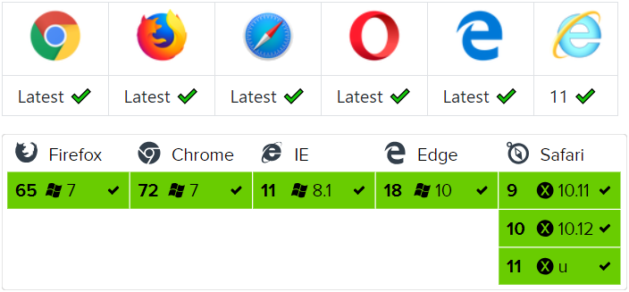

# 第7章 和服务端通信

Vue 不像 jQuery 内置了 ajax 请求函数，在 Vue 中没有提供这样的功能。所以当我们需要在 Vue 中和服务端进行通信的时候可选择的方式会更灵活一些。

> 注意：Vue 不提供的原因是为了让 Vue 本身更专注于视图部分，保持其渐进灵活的特性。

所以 Vue 给了我们更多的选择空间，例如我们可以使用下面的可选方案：

- 原生的 [XMLHttpRequest](https://developer.mozilla.org/zh-CN/docs/Web/API/XMLHttpRequest)
- 原生的 [Fetch](https://developer.mozilla.org/zh-CN/docs/Web/API/Fetch_API/Using_Fetch)
- 也可以结合使用 jQuery 自带的 [Ajax](http://api.jquery.com/category/ajax/) 请求函数
- 早期大家开发 Vue 应用喜欢使用一个第三方插件：[Vue Resource](https://github.com/pagekit/vue-resource)
- 目前主流的方案是使用社区中知名的第三方库 [axios](https://github.com/axios/axios)
- ...

## axios 介绍

### 是什么

axios 是一个基于 Promise 的第三方 HTTP 客户端请求库，可以用于浏览器或者 Node.js。
axios 本身和 Vue 没有一毛钱关系，只是简单纯粹的封装了 HTTP 请求功能。可以运行在任何支持 JavaScript 环境的平台。

- [Github 仓库](https://github.com/axios/axios)

### 特色

- 在浏览器端使用的是 [XMLHttpRequest](https://developer.mozilla.org/zh-CN/docs/Web/API/XMLHttpRequest)
- 在 Node 中使用的是 [http](http://nodejs.org/api/http.html)
- 支持 Promise
- 支持请求拦截和响应拦截
- 支持转换请求和响应数据
- 支持取消请求
- 自动转换 JSON 数据
- 客户端支持防止 XSRF

### 兼容性



> axios 依赖原生的 ECMAScript 6 Promise 支持。
>
> 如果浏览器不支持 ECMAScript 6 Promise，可以使用 [es6-promise](<https://github.com/stefanpenner/es6-promise>) 进行兼容处理。

## 起步

### 安装

使用 npm:

```shell
$ npm install axios
```

使用 bower（一个类似于 npm 的包管理工具，几乎已经淘汰）:

```
$ bower install axios
```

使用 cdn:

```html
<script src="https://unpkg.com/axios/dist/axios.min.js"></script>
```

### 执行一个 `GET` 请求

```javascript
const axios = require('axios');

// Make a request for a user with a given ID
axios.get('/user?ID=12345')
  .then(function (response) {
    // handle success
    console.log(response);
  })
  .catch(function (error) {
    // handle error
    console.log(error);
  })
  .then(function () {
    // always executed
  });

// Optionally the request above could also be done as
axios.get('/user', {
    params: {
      ID: 12345
    }
  })
  .then(function (response) {
    console.log(response);
  })
  .catch(function (error) {
    console.log(error);
  })
  .then(function () {
    // always executed
  });  

// Want to use async/await? Add the `async` keyword to your outer function/method.
async function getUser() {
  try {
    const response = await axios.get('/user?ID=12345');
    console.log(response);
  } catch (error) {
    console.error(error);
  }
}
```

### 执行一个 `POST` 请求

```javascript
axios.post('/user', {
    firstName: 'Fred',
    lastName: 'Flintstone'
  })
  .then(function (response) {
    console.log(response);
  })
  .catch(function (error) {
    console.log(error);
  });
```

### 执行多个并发请求

```javascript
function getUserAccount() {
  return axios.get('/user/12345');
}

function getUserPermissions() {
  return axios.get('/user/12345/permissions');
}

axios.all([getUserAccount(), getUserPermissions()])
  .then(axios.spread(function (acct, perms) {
    // Both requests are now complete
  }));
```

## axios API

### axios(config)

我们可以像使用 `$.ajax()` 一样来使用 `axios`。

```javascript
// Send a POST request
axios({
  method: 'post',
  url: '/user/12345',
  data: {
    firstName: 'Fred',
    lastName: 'Flintstone'
  }
});
```

```javascript
// GET request for remote image
axios({
  method:'get',
  url:'http://bit.ly/2mTM3nY',
  responseType:'stream'
})
  .then(function (response) {
    response.data.pipe(fs.createWriteStream('ada_lovelace.jpg'))
  });
```

### axios(url[, config])

```javascript
// Send a GET request (default method)
axios('/user/12345');
```

### 请求方法别名

为了方便，axios 为所有的请求方法都提供了别名支持。

- axios.request(config)
- axios.get(url[, config])
- axios.delete(url[, config])
- axios.head(url[, config])
- axios.options(url[, config])
- axios.post(url[, data[, config]])
- axios.put(url[, data[, config]])
- axios.patch(url[, data[, config]])

> 注意：当使用了这些别名方法时，`url`, `method` 和 `data` 属性不需要声明在配置对象中。

### 并发请求

axios 提供了辅助函数用来处理并发请求。

- axios.all(iterable)
- axios.spread(callback)

### axios 实例

可以创建一个新的 axios 实例进行自定义配置。

```js
const instance = axios.create({
  baseURL: 'https://some-domain.com/api/',
  timeout: 1000,
  headers: {'X-Custom-Header': 'foobar'}
});

```


### 实例方法

实例拥有和 axios 基本一样的能力。

- axios#request(config)

- axios#get(url[, config])

- axios#delete(url[, config])

- axios#head(url[, config])

- axios#options(url[, config])

- axios#post(url[, data[, config]])

- axios#put(url[, data[, config]])

- axios#patch(url[, data[, config]])

- axios#getUri([config])

## 请求配置对象

下面是所有的可参考配置项。

```json
{
  // `url` is the server URL that will be used for the request
  url: '/user',

  // `method` is the request method to be used when making the request
  method: 'get', // default

  // `baseURL` will be prepended to `url` unless `url` is absolute.
  // It can be convenient to set `baseURL` for an instance of axios to pass relative URLs
  // to methods of that instance.
  baseURL: 'https://some-domain.com/api/',

  // `transformRequest` allows changes to the request data before it is sent to the server
  // This is only applicable for request methods 'PUT', 'POST', and 'PATCH'
  // The last function in the array must return a string or an instance of Buffer, ArrayBuffer,
  // FormData or Stream
  // You may modify the headers object.
  transformRequest: [function (data, headers) {
    // Do whatever you want to transform the data

    return data;
  }],

  // `transformResponse` allows changes to the response data to be made before
  // it is passed to then/catch
  transformResponse: [function (data) {
    // Do whatever you want to transform the data

    return data;
  }],

  // `headers` are custom headers to be sent
  headers: {'X-Requested-With': 'XMLHttpRequest'},

  // `params` are the URL parameters to be sent with the request
  // Must be a plain object or a URLSearchParams object
  params: {
    ID: 12345
  },

  // `paramsSerializer` is an optional function in charge of serializing `params`
  // (e.g. https://www.npmjs.com/package/qs, http://api.jquery.com/jquery.param/)
  paramsSerializer: function (params) {
    return Qs.stringify(params, {arrayFormat: 'brackets'})
  },

  // `data` is the data to be sent as the request body
  // Only applicable for request methods 'PUT', 'POST', and 'PATCH'
  // When no `transformRequest` is set, must be of one of the following types:
  // - string, plain object, ArrayBuffer, ArrayBufferView, URLSearchParams
  // - Browser only: FormData, File, Blob
  // - Node only: Stream, Buffer
  data: {
    firstName: 'Fred'
  },

  // `timeout` specifies the number of milliseconds before the request times out.
  // If the request takes longer than `timeout`, the request will be aborted.
  timeout: 1000, // default is `0` (no timeout)

  // `withCredentials` indicates whether or not cross-site Access-Control requests
  // should be made using credentials
  withCredentials: false, // default

  // `adapter` allows custom handling of requests which makes testing easier.
  // Return a promise and supply a valid response (see lib/adapters/README.md).
  adapter: function (config) {
    /* ... */
  },

  // `auth` indicates that HTTP Basic auth should be used, and supplies credentials.
  // This will set an `Authorization` header, overwriting any existing
  // `Authorization` custom headers you have set using `headers`.
  auth: {
    username: 'janedoe',
    password: 's00pers3cret'
  },

  // `responseType` indicates the type of data that the server will respond with
  // options are 'arraybuffer', 'blob', 'document', 'json', 'text', 'stream'
  responseType: 'json', // default

  // `responseEncoding` indicates encoding to use for decoding responses
  // Note: Ignored for `responseType` of 'stream' or client-side requests
  responseEncoding: 'utf8', // default

  // `xsrfCookieName` is the name of the cookie to use as a value for xsrf token
  xsrfCookieName: 'XSRF-TOKEN', // default

  // `xsrfHeaderName` is the name of the http header that carries the xsrf token value
  xsrfHeaderName: 'X-XSRF-TOKEN', // default

  // `onUploadProgress` allows handling of progress events for uploads
  onUploadProgress: function (progressEvent) {
    // Do whatever you want with the native progress event
  },

  // `onDownloadProgress` allows handling of progress events for downloads
  onDownloadProgress: function (progressEvent) {
    // Do whatever you want with the native progress event
  },

  // `maxContentLength` defines the max size of the http response content in bytes allowed
  maxContentLength: 2000,

  // `validateStatus` defines whether to resolve or reject the promise for a given
  // HTTP response status code. If `validateStatus` returns `true` (or is set to `null`
  // or `undefined`), the promise will be resolved; otherwise, the promise will be
  // rejected.
  validateStatus: function (status) {
    return status >= 200 && status < 300; // default
  },

  // `maxRedirects` defines the maximum number of redirects to follow in node.js.
  // If set to 0, no redirects will be followed.
  maxRedirects: 5, // default

  // `socketPath` defines a UNIX Socket to be used in node.js.
  // e.g. '/var/run/docker.sock' to send requests to the docker daemon.
  // Only either `socketPath` or `proxy` can be specified.
  // If both are specified, `socketPath` is used.
  socketPath: null, // default

  // `httpAgent` and `httpsAgent` define a custom agent to be used when performing http
  // and https requests, respectively, in node.js. This allows options to be added like
  // `keepAlive` that are not enabled by default.
  httpAgent: new http.Agent({ keepAlive: true }),
  httpsAgent: new https.Agent({ keepAlive: true }),

  // 'proxy' defines the hostname and port of the proxy server.
  // You can also define your proxy using the conventional `http_proxy` and
  // `https_proxy` environment variables. If you are using environment variables
  // for your proxy configuration, you can also define a `no_proxy` environment
  // variable as a comma-separated list of domains that should not be proxied.
  // Use `false` to disable proxies, ignoring environment variables.
  // `auth` indicates that HTTP Basic auth should be used to connect to the proxy, and
  // supplies credentials.
  // This will set an `Proxy-Authorization` header, overwriting any existing
  // `Proxy-Authorization` custom headers you have set using `headers`.
  proxy: {
    host: '127.0.0.1',
    port: 9000,
    auth: {
      username: 'mikeymike',
      password: 'rapunz3l'
    }
  },

  // `cancelToken` specifies a cancel token that can be used to cancel the request
  // (see Cancellation section below for details)
  cancelToken: new CancelToken(function (cancel) {
  })
}
```


## 响应体结构

请求的响应包含以下信息。

```json
{
  // `data` is the response that was provided by the server
  data: {},

  // `status` is the HTTP status code from the server response
  status: 200,

  // `statusText` is the HTTP status message from the server response
  statusText: 'OK',

  // `headers` the headers that the server responded with
  // All header names are lower cased
  headers: {},

  // `config` is the config that was provided to `axios` for the request
  config: {},

  // `request` is the request that generated this response
  // It is the last ClientRequest instance in node.js (in redirects)
  // and an XMLHttpRequest instance the browser
  request: {}
}
```

当使用 `then` 方法时，将收到如下结果

```js
axios.get('/user/12345')
  .then(function (response) {
    console.log(response.data);
    console.log(response.status);
    console.log(response.statusText);
    console.log(response.headers);
    console.log(response.config);
  });
```


## 默认配置

### 全局 axios 配置

```js
axios.defaults.baseURL = 'https://api.example.com';
axios.defaults.headers.common['Authorization'] = AUTH_TOKEN;
axios.defaults.headers.post['Content-Type'] = 'application/x-www-form-urlencoded';
```


### 自定义 axios 实例配置

```js
// Set config defaults when creating the instance
const instance = axios.create({
  baseURL: 'https://api.example.com'
});

// Alter defaults after instance has been created
instance.defaults.headers.common['Authorization'] = AUTH_TOKEN;
```


### 配置的优先级

当全局、实例、请求出现相同的 config 配置项时，优先级如下

- 请求的 config
- 实例的 config
- 全局的 config

> 自上而下

例如下面的情况：

```js
// Create an instance using the config defaults provided by the library
// At this point the timeout config value is `0` as is the default for the library
const instance = axios.create();

// Override timeout default for the library
// Now all requests using this instance will wait 2.5 seconds before timing out
instance.defaults.timeout = 2500;

// Override timeout for this request as it's known to take a long time
instance.get('/longRequest', {
  timeout: 5000
});
```


## 拦截器

axios 支持在处理请求或响应之前拦截请求或响应。

```js
// Add a request interceptor
axios.interceptors.request.use(function (config) {
    // Do something before request is sent
    return config;
  }, function (error) {
    // Do something with request error
    return Promise.reject(error);
  });

// Add a response interceptor
axios.interceptors.response.use(function (response) {
    // Do something with response data
    return response;
  }, function (error) {
    // Do something with response error
    return Promise.reject(error);
  });
```

也可以删除拦截器

```js
const myInterceptor = axios.interceptors.request.use(function () {/*...*/});
axios.interceptors.request.eject(myInterceptor);
```

也可以为自定义 axios 实例添加拦截器

```js
const instance = axios.create();
instance.interceptors.request.use(function () {/*...*/});
```


## 处理错误

```js
axios.get('/user/12345')
  .catch(function (error) {
    if (error.response) {
      // The request was made and the server responded with a status code
      // that falls out of the range of 2xx
      console.log(error.response.data);
      console.log(error.response.status);
      console.log(error.response.headers);
    } else if (error.request) {
      // The request was made but no response was received
      // `error.request` is an instance of XMLHttpRequest in the browser and an instance of
      // http.ClientRequest in node.js
      console.log(error.request);
    } else {
      // Something happened in setting up the request that triggered an Error
      console.log('Error', error.message);
    }
    console.log(error.config);
  });
```

可以使用validateStatus配置选项定义自定义HTTP状态代码错误范围。

```js
axios.get('/user/12345', {
  validateStatus: function (status) {
    return status < 500; // Reject only if the status code is greater than or equal to 500
  }
})
```


## 取消请求

可以使用取消令牌取消 token。

可以使用 `CancelToken.source` 工厂函数创建取消令牌，如下所示：

```js
const CancelToken = axios.CancelToken;
const source = CancelToken.source();

axios.get('/user/12345', {
  cancelToken: source.token
}).catch(function (thrown) {
  if (axios.isCancel(thrown)) {
    console.log('Request canceled', thrown.message);
  } else {
    // handle error
  }
});

axios.post('/user/12345', {
  name: 'new name'
}, {
  cancelToken: source.token
})

// cancel the request (the message parameter is optional)
source.cancel('Operation canceled by the user.');
```

还可以通过将函数执行程序传递给 Cancel Token 构造函数来创建取消令牌：

```js
const CancelToken = axios.CancelToken;
let cancel;

axios.get('/user/12345', {
  cancelToken: new CancelToken(function executor(c) {
    // An executor function receives a cancel function as a parameter
    cancel = c;
  })
});

// cancel the request
cancel();
```

> 注意：可以使用相同的取消令牌取消多个请求。

## 使用 application/x-www-form-urlencoded

默认情况下，axios 将 JavaScript 对象序列化为 `JSON`。要以 `application / x-www-form-urlencoded` 格式发送数据，您可以使用以下选项之一。


### 浏览器端

在浏览器中，您可以使用 [`URLSearchParams`](https://developer.mozilla.org/en-US/docs/Web/API/URLSearchParams) API，如下所示：

```js
const params = new URLSearchParams();
params.append('param1', 'value1');
params.append('param2', 'value2');
axios.post('/foo', params);
```

> 有些浏览器还不支持 URLSearchParms，可以使用这个 [polyfill](<https://github.com/WebReflection/url-search-params>) 做兼容处理。

另外也可以使用 [qs](<https://github.com/ljharb/qs>) 来进行处理

```js
const qs = require('qs');
axios.post('/foo', qs.stringify({ 'bar': 123 }));
```

或者在 ECMAScript 6 中

```js
import qs from 'qs';
const data = { 'bar': 123 };
const options = {
  method: 'POST',
  headers: { 'content-type': 'application/x-www-form-urlencoded' },
  data: qs.stringify(data),
  url,
};
axios(options);
```


### Node.js

在node.js中，您可以使用 [querystring](https://nodejs.org/api/querystring.html) 模块，如下所示：

```js
const querystring = require('querystring');
axios.post('http://something.com/', querystring.stringify({ foo: 'bar' }));
```

你也可以使用 [qs](https://github.com/ljharb/qs)。

> 注意：querystring 模块不支持嵌套对象，qs 模块支持。

## 发送文件

axios 支持发送 XHR 2.0 中新增的 FormData 对象。

```js
const formData = new FormData()
formData.append('file', document.getElementById('file').files[0])

axops({
  method: 'POST',
  url: 'xxx',
  data: formData
}).then(res => {
  console.log(res)
})
```

> axios 会自动识别数据对象 FormData，并将请求头中的 Content-Type 设置为 `multipart/form-data`。

## 在 Vue 中使用 axios

1. 从模块化角度考虑，建议将 axios 配置相关代码放到一个独立的模块中
2. 使用 axios 建议通过创建单独的 axios 实例的方式，例如当你的应用有多个不同域名的接口的时候，就可以创建多个 axios 实例分别配置
3. 当然，如果你的接口域名只有一个，可以不创建实例，直接配置全局的 axios 也是可以的，但根据经验，推荐实例方式，因为当你有了这样的需求的时候，我们只需要增加代码而不需要修改代码
4. 我们最后要使用封装好的 axios 发送请求，有两种方式
   1. 方式一：在哪个组件中发送请求就在哪里 import 引入
   2. 方式二：几乎每个组件都需要发送请求，所以可以将 axios 挂载到 Vue 原型上，这样就可以直接在组件中通过 this.xxx 来访问 axios 了，而不需要每次都来 import
   3. 方式三：为了项目的更好维护性，我们建议将所有的请求都封装为 api 模块中的请求函数，这样哪里需要就在哪里加载调用。由于 api 是独立的 js 模块，不是组件，所以在 api 模块中发送请求必须 import  导入  axios 函数。所以这种情况下将 axios 挂载到 Vue 原型上就没有意义了，因为 api 中也调用不到
   4. 最后：推荐方式二（更简单） + 方式三（可维护性好，推荐）