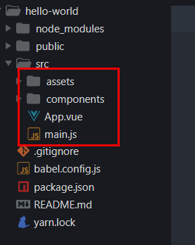
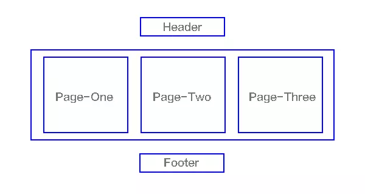

# 第9章 Vue CLI

[Vue CLI](https://cli.vuejs.org/) 是 Vue 的脚手架工具，它可以帮助我们快速生成 Vue 基础项目代码，提供开箱即用的功能特性。

- 基础代码目录结构
- 开发服务
- 本地调试
- 代码部署
- 热加载
- 单元测试
- ...

Vue CLI 致力于将 Vue 生态中的工具基础标准化。它确保了各种构建工具能够基于智能的默认配置即可平稳衔接，这样你可以专注在撰写应用上，而不必花好几天去纠结配置的问题。与此同时，它也为每个工具提供了调整配置的灵活性，无需 eject。


- 官方文档：https://cli.vuejs.org/
- GitHub：https://github.com/vuejs/vue-cli


## 安装

```bash
npm install -g @vue/cli
# OR
yarn global add @vue/cli
```

使用 `vue --version` 确认是否安装成功。


> 注意：全局工具安装一次就可以了，以后直接使用即可。

使用 `vue --help` 查看使用帮助。


## 创建项目

运行以下命令来创建一个新项目

```bash
vue create my-project
```


选择 default，然后等待安装


继续等待...


安装成功。

> 最后会提示你使用 cd 命令进入刚刚创建生成的项目中。
>
> 然后让你执行 yarn serve（如果没有安装 yarn，则这里是 npm） 去启动你的项目。

启动开发模式：

```bash
npm run serve
```


等待启动开发服务。。。


启动开发服务成功。

然后打开浏览器，访问提示的地址。


如果能看到上面的页面，则说明初始化创建成功了。

## 目录结构


| 名称              | 说明                                                |
| ----------------- | --------------------------------------------------- |
| node_modules      | 第三方包存储目录                                    |
| public            | 静态资源，已被托管                                  |
| src               | 源代码                                              |
| .gitignore        | git忽略文件，暂时不关心，我们还没有在项目中使用 git |
| babel.config.js   | 先不关心                                            |
| package.json      | 包说明文件                                          |
| README.md         | 项目的说明文本文件                                  |
| package-lock.json | 包的版本锁定文件                                    |

### src 目录结构



| 名称       | 说明                               |
| ---------- | ---------------------------------- |
| assets     | 资源目录，存储静态资源，例如图片等 |
| components | 存储其它组件的目录                 |
| App.vue    | 根组件                             |
| main.js    | 入口文件                           |


##  程序的启动

- 找到 `main.js` 入口
- 加载 Vue
- 加载 App 组件
- 创建 Vue 实例
- 将 App 组件替换到入口节点


接下来，我们就不再去 html 页面中写模板了，而是**一切皆组件**。

## .vue 单文件组件

### template

- 作用：组件的模板
- 注意：只能有一个根节点（template 本身不算）

### script

- 作用：组件的 JavaScript ，用来配置组件的选项（data、methods、watch。。。）

写法规则：

```html
<script>
	// 1. 使用一个普通对象配置组件的选项
  const componentOptions = {
    data () {
      return {}
    },
    methods: {}
  }
  
  // 2. 将这个对象导出（组件的选项对象必须显式的导出，否则不会生效）
  export default componentOptions
</script>
```

为了方便，我们可以直接在定义的同时直接导出

```html
<script>
  export default {
    data () {
      return {}
    },
    methods: {}
  }
</script>
```


### style

当 `<style>` 标签有 `scoped` 属性时，它的 CSS 只作用于当前组件中的元素。

```html
<style scoped>
.example {
  color: red;
}
</style>

<template>
  <div class="example">hi</div>
</template>
```

转换结果：

```html
<style>
.example[data-v-f3f3eg9] {
  color: red;
}
</style>

<template>
  <div class="example" data-v-f3f3eg9>hi</div>
</template>
```

你可以在一个组件中同时使用有 scoped 和非 scoped 样式：

```html
<style>
/* 全局样式 */
</style>

<style scoped>
/* 本地样式 */
</style>
```

使用 `scoped` 后，父组件的样式将不会渗透到子组件中。不过一个子组件的根节点会同时受其父组件的 scoped CSS 和子组件的 scoped CSS 的影响。这样设计是为了让父组件可以从布局的角度出发，调整其子组件根元素的样式。

如果你希望 `scoped` 样式中的一个选择器能够作用得“更深”，例如影响子组件，你可以使用 `>>>` 操作符：

```html
<style scoped>
.a >>> .b { /* ... */ }
</style>
```

上述代码将会编译成：

```css
.a[data-v-f3f3eg9] .b { /* ... */ }
```

## 单文件组件的定义和使用

### 创建单文件组件

- 推荐把通用组件创建到 `components` 目录中
- 把视图组件定义到 `views` 目录中
- 单文件组件只是承载组件的容器而已，既不是全局也不是局部，如果要使用这个单文件组件，必须 **注册**
  - 全局注册使用，可以在任何组件中使用
  - 局部注册使用，只能在注册的组件中被使用

```html
<template>
	<div>
    foo 组件
  </div>
</template>
```


### 全局注册使用

在 main.js 文件中

```javascript
...
import Vue from 'vue'
import Com1 from './components/Com1.vue'

...

Vue.component('Com1', Com1)
```

接下来就可以在任何组件中使用 Com1 组件了。

### 局部注册使用

在某个组价中局部注册使用

```html
<template>
	<div>
    <!-- 使用 Com2 组件 -->
    <Com2></Com2>
  </div>
</template>
<script>
	import Com2 from './components/Com2'
  
  export default {
    components: {
      Com2
    }
  }
</script>
```


## 热重载

当使用脚手架工具 `vue-cli` 时，热重载是开箱即用的。

“热重载”不只是当你修改文件的时候简单重新加载页面。启用热重载后，当你修改 `.vue` 文件时，该组件的所有实例将在**不刷新页面**的情况下被替换。它甚至保持了应用程序和被替换组件的当前状态！当你调整模版或者修改样式时，这极大地提高了开发体验。


### 状态保留规则

- 当编辑一个组件的 `<template>` 时，这个组件实例将就地重新渲染，并保留当前所有的私有状态。能够做到这一点是因为模板被编译成了新的无副作用的渲染函数。

- 当编辑一个组件的 `<script>` 时，这个组件实例将就地销毁并重新创建。(应用中其它组件的状态将会被保留) 是因为 `<script>` 可能包含带有副作用的生命周期钩子，所以将重新渲染替换为重新加载是必须的，这样做可以确保组件行为的一致性。这也意味着，如果你的组件带有全局副作用，则整个页面将会被重新加载。

- <style> 会通过 vue-style-loader 自行热重载，所以它不会影响应用的状态。

## 函数式组件

在一个 `*.vue` 文件中以单文件形式定义的函数式组件，现在对于模板编译、scoped CSS 和热重载也有了良好的支持。

要声明一个应该编译为函数式组件的模板，请将 `functional` 特性添加到模板块中。这样做以后就可以省略 `<script>` 块中的 `functional` 选项。

模板中的表达式会在[函数式渲染上下文](https://cn.vuejs.org/v2/guide/render-function.html#%E5%87%BD%E6%95%B0%E5%BC%8F%E7%BB%84%E4%BB%B6)中求值。这意味着在模板中，prop 需要以 `props.xxx` 的形式访问：

```html
<template functional>
  <div>{{ props.foo }}</div>
</template>
```

你可以在 `parent` 上访问 `Vue.prototype` 全局定义的属性：

```html
<template functional>
  <div>{{ parent.$someProperty }}</div>
</template>
```


## 代码校验

## ECMAScript 6 Module

历史上，JavaScript 一直没有模块（module）体系，无法将一个大程序拆分成互相依赖的小文件，再用简单的方法拼装起来。其他语言都有这项功能，比如 Ruby 的`require`、Python 的`import`，甚至就连 CSS 都有`@import`，但是 JavaScript 任何这方面的支持都没有，这对开发大型的、复杂的项目形成了巨大障碍。

在 ES6 之前，社区制定了一些模块加载方案，最主要的有 CommonJS 和 AMD（require.js 库，专门用于在浏览器中进行模块化开发，几乎已经淘汰了） 两种。前者用于服务器（Node.js），后者用于浏览器。ES6 在语言标准的层面上，实现了模块功能，而且实现得相当简单，完全可以取代 CommonJS 和 AMD 规范，成为浏览器和服务器通用的模块解决方案。


### 学习准备环境

目前无论是 Node.js 还是浏览器都还无法直接原生支持 ECMAScript 6 模块 API（import、export）。

但是对于浏览器来说我们可以使用构建工具将模块代码转换为浏览器能识别的代码。

Node.js 中可以开启实验功能来支持该功能。

为了学习方便，我们这里使用 Node 环境来学习ES6 模块规则。

首先将你的文件后缀名定义为 `.mjs`，然后执行这个脚本文件的时候加上 `--experimental-modules` 选项。

例如我有一个 `main.mjs`，则执行命令是：

```bash
node --experimental-modules main.mjs
```

> 这里只是用于测试学习，不要在生产环境中使用这个模块规则。


foo.js

```javascript
// export 也用于导出
// 但是可以多次使用
export const a = 1
export const b = 2
export const c = 3
export const d = 4

function add(x, y) {
  return x + y
}

// 等价于 module.exports = add
// export default 只能使用一次
export default add

// 模块中有多个成员，一般都使用 export xxx
// 如果只有一个成员，那就 export default
// 有时候也会混搭
//   既有 export default 成员（只能有一个）
//   也有 export xxx成员（多个）

```

main.js

```javascript
// 加载 export default 导出的成员
// import foo from './foo'
// console.log(foo)


// 按需加载 export 导出的成员
// import { a, b } from './foo.mjs'
// console.log(a, b)

// 一次性加载所有成员(包括 default 成员)
// import * as foo from './foo.mjs'
// console.log(foo)
// console.log(foo.a)
// console.log(foo.default(10, 3)) // 很少这样去访问 default 成员

// 为了方便，先加载默认 default 成员，然后加载 其它 export 成员
// import abc, { a, b } from './foo'
// console.log(abc) // export default 成员
// console.log(a, b) // 

// 可以使用 as 起别名
import { a as aa } from './foo'
console.log(aa)


// console.log(foo(1, 2))

```

### 导出

如果模块只有一个成员，建议 `export default`

```javascript
export default 数字|字符串|数组|对象|函数。。。
```

> 注意：export default 只能有一次，重复会报错

如果一个模块有多个成员

```javascript
export default {
  成员1: 值,
  成员2: 值2,
  成员3...
}
```

> 如果成员之间没有依赖关系，不是用于某个数据的完整整体，不推荐，你可能只使用其中某个成员，而必须加载整体数据对象
>
> 除非这个对象是一个完整的整体，例如 Vue 组件的实例选项对象，这样是可以的


ECMAScript 6 提供了一种更优化的方案，当多个成员没有具体的依赖关系的时候，我们推荐使用 `export` 语法进行导出，因为它支持按需加载，就是说你用什么就只加载什么，其它多余的都不要，这样有利于程序的执行效率。

```javascript
export const a = 1
export const b = 2
```

也可以集中按需导出多个成员

```javascript
const a = 1
const b = 2
const c = 3

// 语法就是这样，后面的成员也不是对象的简写方式， {} 中的成员必须当前模块能够访问的成员名称
export {
	a,
  b,
  c
}

// 以上写法等价于
// export const a = 1
// export const b = 2
// export const c = 3
```


有时候模块中有很多成员的时候，我们会 `export default` 和 `export` 一起使用。

我们把最常用的使用 `export default` 导出，把不太常用的使用 `export` 导出（用于按需加载）。

```javascript
export const a = 1
export const b = 2

export default function (x, y) {
  return x + y
}
```


### 导入

加载 export default 成员

```javascript
import xxx from '模块路径'
```


按需加载 export 成员

```javascript
import { 成员1 as 别名, 成员2... } from '模块路径'
```


混着加载 export default 和 export 成员

```javascript
import xxx, { 成员1, 成员2... } from '模块路径'
```


一次性加载所有成员

```javascript
import * as xxx from '模块路径' 
```

> 包括 export default 和 export 所有成员
>
> export default 就是一个名字叫 default 的成员，知道即可，不推荐这样来使用 xxx.default

## 综合案例

- 单页面应用程序
- Vue（全家桶一员）
- Vue CLI（全家桶）
- axios（全家桶）
  - Vue 本身不提供 ajax 封装请求
  - 我们可以使用原生 XHR
  - 也可以使用jQuery 的 ajax（没必要，浪费）
  - 我们推荐更纯粹的 axios（这个库只封装了 ajax 操作）
- Vue Router（全家桶一员）
- 模块化（ECMAScript 6 Module）
  - import
  - export


## 单页面应用程序


### 概念

传统的多页面网站应用交互模型


单页Web应用（single page web application，SPA），就是只有一张Web页面的应用，是加载单个HTML 页面并在用户与应用程序交互时动态更新该页面的Web应用程序。




### 优点

- 非常适合前后端分离开发
  - 人员职责
    - 后端负责处理数据，提供接口
    - 前端负责页面，调用接口使用数据
  - 项目工程
    - 服务端接口项目工程
    - 前端页面项目工程
- 响应速度快，用户体验好
  - 页面切换的时候，保留公共部分，展示不同的页面内容


1. 分离前后端关注点，前端负责界面显示，后端负责数据存储和计算，各司其职，不会把前后端的逻辑混杂在一起；
2. 减轻服务器压力，服务器只用出数据就可以，不用管展示逻辑和页面合成，吞吐能力会提高几倍
3. 同一套后端程序代码，不用修改就可以用于Web界面、手机、平板等多种客户端；


### 缺点


2、前进、后退、地址栏等，需要程序进行管理；
3、书签，需要程序来提供支持；


- 不利于 SEO （搜索引擎优化）
- 初次加载耗时较多
  - 单页应用有两种加载方式
  - 方式一：用户请求页面的时候，把所有的页面（组件）资源都下载下来，完了切换页面的时候速度就非常快，第一次慢一点，以后就很快了
  - 方式二：用户请求的页面的时候，只加载公共资源和当前页面资源，其它页面（组件）资源只在查看需要的时候才异步请求下载
  - 如果页面比较少，推荐第一种方式，如果页面比较多，推荐第二种方式
- 前进、后退、地址栏等，需要程序进行管理
  - hash
  - HTML5 history
  - Vue Router 都解决了


- 缺点：不利于 SEO 优化
  - 能不能解决？可以。
  - 更高级的一个概念：前后端同构
  - Vue 提供了一个服务端渲染解决方案：Vue Server Renderers（不是非常的成熟），使用成本非常高
    - 能让你在 Node 创建的 Web 服务中把 Vue 当做模板引擎来使用
  - 说白了就是服务端渲染结合单页面渲染的特点，既能拥有 SEO 优化，还能保持单页面应用的优点。
- 适合开发后台管理系统、移动端页面（交互方式就像访问原生 App 一样）

### 单页面导航路径

- 概念
- 路径
  - 一般使用锚点，也就是 hash 作为页面导航的路径标识
  - 为什么？因为正常的 url 地址会发请求，而 hash 锚点不会发请求刷新页面
- VueRouter 内部监视了 hash  的改变
  - window.onhashchange
- 然后根据 hash  的改变去展示路由规则中配置的组件
- Vue Router 默认要求  hash 导航路径都以 #/ 开头
  - 为什么？
  - 主要是为了和正常的 hash 锚点（网页内部定位，id）作区别
  - 例如我们使用锚点内部定位的时候，需要给元素起 id，我们几乎不会给这个id起名为 /xxx
  - 如果 VueRouter 没有 #/ 的规则，例如直接 #foo 就可能会和你锚点的那个 id foo 冲突。

有人会说，能不能让 url 漂亮点儿，不要使用 hash 呢？

可以。

我们可以利用 HTML5 history 的的方式使用传统的 url。（我们可以用 JavaScript 代码控制 url）。

- VueRouter 默认是 hash 路径模式
- 它也支持传统的 url 模式（HTML5 history）https://router.vuejs.org/zh/guide/#html
  - 需要额外的服务器配置


### 相关链接

- [单页应用有那些优缺点？](https://www.zhihu.com/question/20792064)
- https://juejin.im/post/5a0ea4ec6fb9a0450407725c

## 相关命令

```bash
# 启动开发服务
npm run serve

# 项目打包
npm run build

# 代码检查
npm run lint
```
