# 第9章 Vue CLI

[Vue CLI](https://cli.vuejs.org/) 是 Vue 的脚手架工具，它可以帮助我们快速生成 Vue 基础项目代码，提供开箱即用的功能特性。

- 基础代码目录结构
- 开发服务
- 本地调试
- 代码部署
- 热加载
- 单元测试
- ...

Vue CLI 致力于将 Vue 生态中的工具基础标准化。它确保了各种构建工具能够基于智能的默认配置即可平稳衔接，这样你可以专注在撰写应用上，而不必花好几天去纠结配置的问题。与此同时，它也为每个工具提供了调整配置的灵活性，无需 eject。


- 官方文档：https://cli.vuejs.org/
- GitHub：https://github.com/vuejs/vue-cli


## 安装

```bash
npm install -g @vue/cli
# OR
yarn global add @vue/cli
```

使用 `vue --version` 确认是否安装成功。

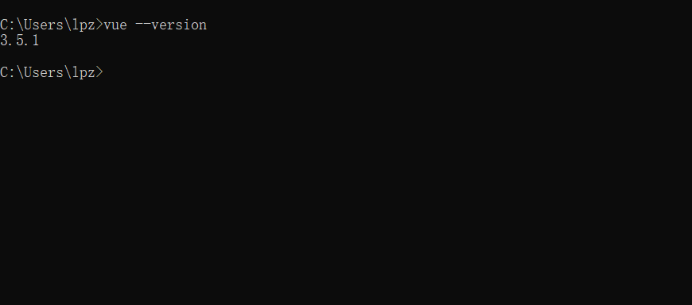

使用 `vue --help` 查看使用帮助。

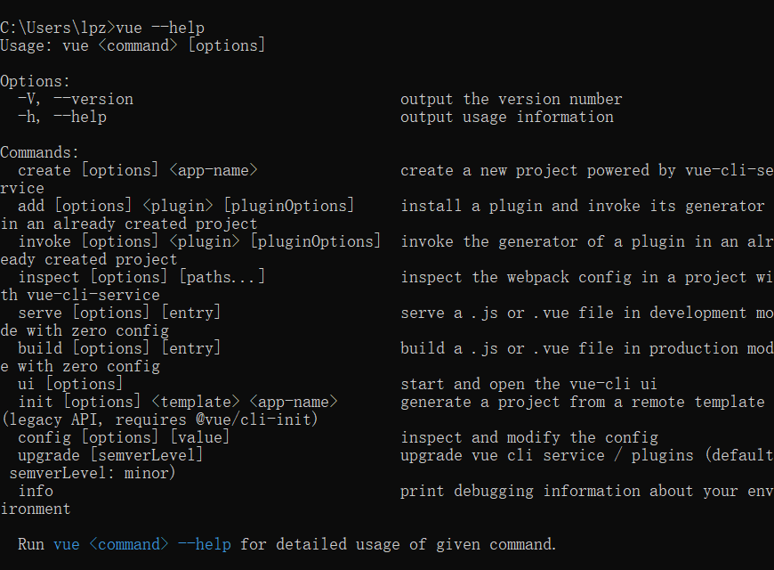

## 创建项目

运行以下命令来创建一个新项目

```bash
vue create my-project
```

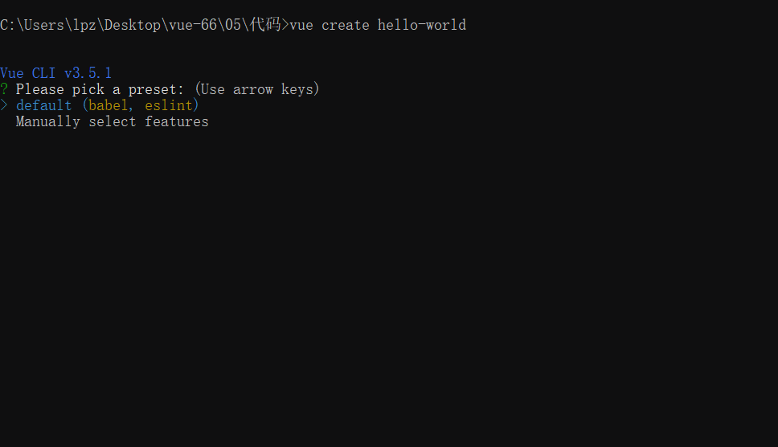

选择 default，然后等待安装

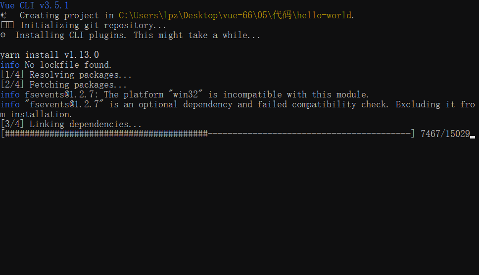

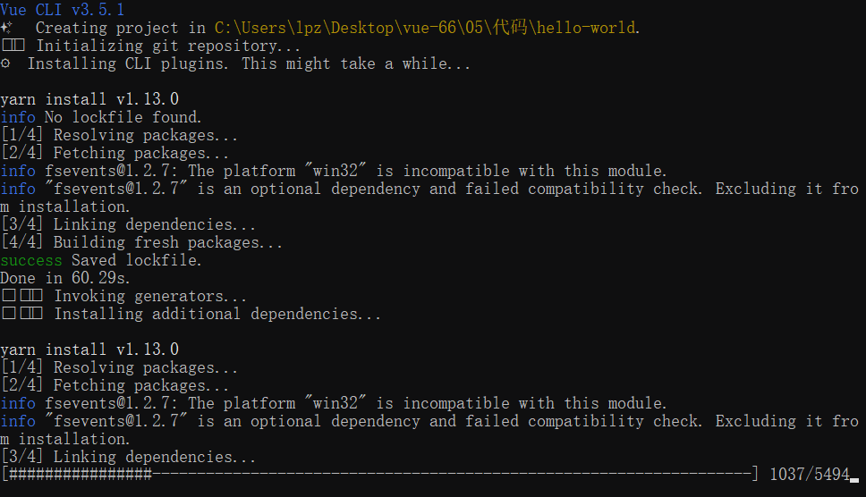

继续等待...

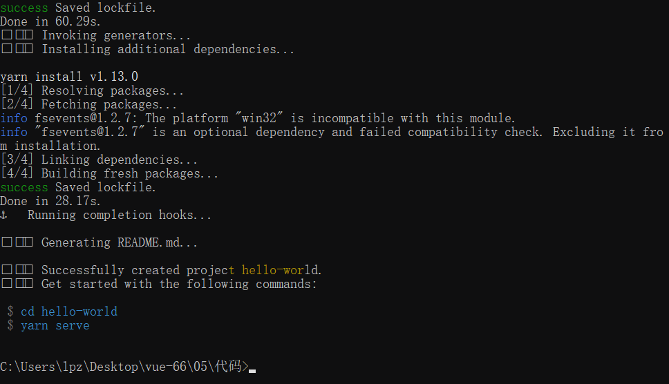

安装成功。

> 最后会提示你使用 cd 命令进入刚刚创建生成的项目中。
>
> 然后让你执行 yarn serve（如果没有安装 yarn，则这里是 npm） 去启动你的项目。

启动开发模式：

```bash
npm run serve
```

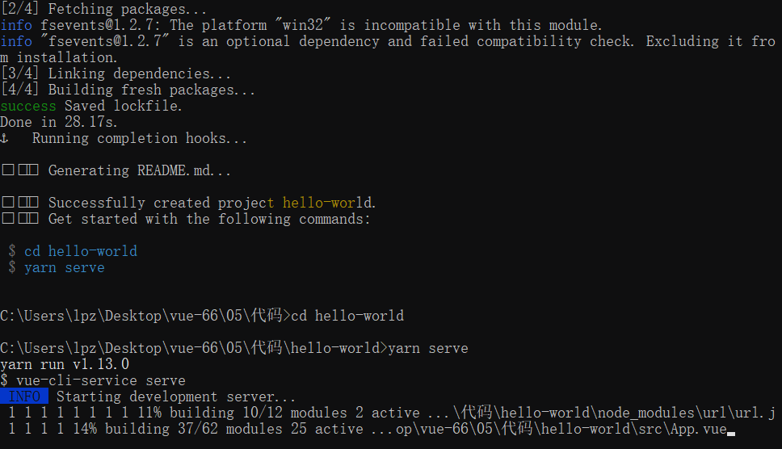

等待启动开发服务。。。

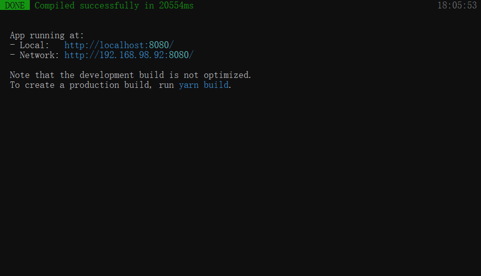

启动开发服务成功。

然后打开浏览器，访问提示的地址。

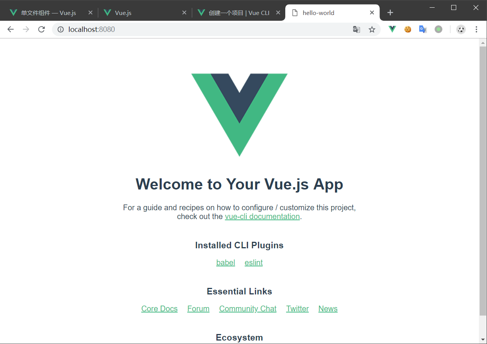

如果能看到上面的页面，则说明初始化创建成功了。

## 目录结构

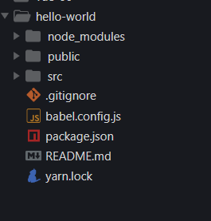


| 名称              | 说明                                                |
| ----------------- | --------------------------------------------------- |
| node_modules      | 第三方包存储目录                                    |
| public            | 静态资源，已被托管                                  |
| src               | 源代码                                              |
| .gitignore        | git忽略文件，暂时不关心，我们还没有在项目中使用 git |
| babel.config.js   | 先不关心                                            |
| package.json      | 包说明文件                                          |
| README.md         | 项目的说明文本文件                                  |
| package-lock.json | 包的版本锁定文件                                    |

### src 目录结构

###  main.js

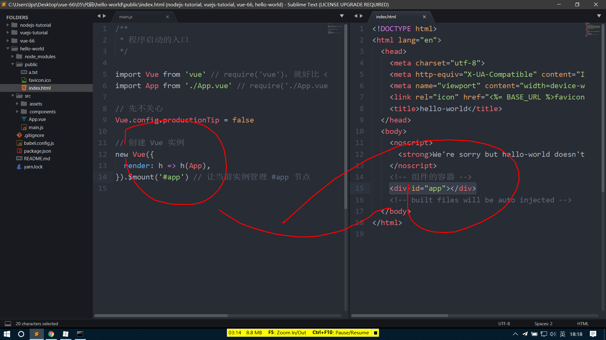

## 组件化构建模型图

## .vue 单文件组件

### template

### script

### style

当 `<style>` 标签有 `scoped` 属性时，它的 CSS 只作用于当前组件中的元素。

```html
<style scoped>
.example {
  color: red;
}
</style>

<template>
  <div class="example">hi</div>
</template>
```

转换结果：

```html
<style>
.example[data-v-f3f3eg9] {
  color: red;
}
</style>

<template>
  <div class="example" data-v-f3f3eg9>hi</div>
</template>
```

你可以在一个组件中同时使用有 scoped 和非 scoped 样式：

```html
<style>
/* 全局样式 */
</style>

<style scoped>
/* 本地样式 */
</style>
```

使用 `scoped` 后，父组件的样式将不会渗透到子组件中。不过一个子组件的根节点会同时受其父组件的 scoped CSS 和子组件的 scoped CSS 的影响。这样设计是为了让父组件可以从布局的角度出发，调整其子组件根元素的样式。

如果你希望 `scoped` 样式中的一个选择器能够作用得“更深”，例如影响子组件，你可以使用 `>>>` 操作符：

```html
<style scoped>
.a >>> .b { /* ... */ }
</style>
```

上述代码将会编译成：

```css
.a[data-v-f3f3eg9] .b { /* ... */ }
```

## 热重载

当使用脚手架工具 `vue-cli` 时，热重载是开箱即用的。

“热重载”不只是当你修改文件的时候简单重新加载页面。启用热重载后，当你修改 `.vue` 文件时，该组件的所有实例将在**不刷新页面**的情况下被替换。它甚至保持了应用程序和被替换组件的当前状态！当你调整模版或者修改样式时，这极大地提高了开发体验。

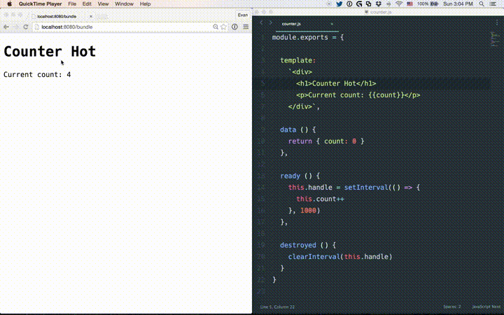

### 状态保留规则

- 当编辑一个组件的 `<template>` 时，这个组件实例将就地重新渲染，并保留当前所有的私有状态。能够做到这一点是因为模板被编译成了新的无副作用的渲染函数。

- 当编辑一个组件的 `<script>` 时，这个组件实例将就地销毁并重新创建。(应用中其它组件的状态将会被保留) 是因为 `<script>` 可能包含带有副作用的生命周期钩子，所以将重新渲染替换为重新加载是必须的，这样做可以确保组件行为的一致性。这也意味着，如果你的组件带有全局副作用，则整个页面将会被重新加载。

- <style> 会通过 vue-style-loader 自行热重载，所以它不会影响应用的状态。

## 函数式组件

在一个 `*.vue` 文件中以单文件形式定义的函数式组件，现在对于模板编译、scoped CSS 和热重载也有了良好的支持。

要声明一个应该编译为函数式组件的模板，请将 `functional` 特性添加到模板块中。这样做以后就可以省略 `<script>` 块中的 `functional` 选项。

模板中的表达式会在[函数式渲染上下文](https://cn.vuejs.org/v2/guide/render-function.html#%E5%87%BD%E6%95%B0%E5%BC%8F%E7%BB%84%E4%BB%B6)中求值。这意味着在模板中，prop 需要以 `props.xxx` 的形式访问：

```html
<template functional>
  <div>{{ props.foo }}</div>
</template>
```

你可以在 `parent` 上访问 `Vue.prototype` 全局定义的属性：

```html
<template functional>
  <div>{{ parent.$someProperty }}</div>
</template>
```


## 代码校验

## ECMAScript 6 Module

## 相关命令

```bash
# 启动开发服务
npm run serve

# 项目打包
npm run build

# 代码检查
npm run lint
```
