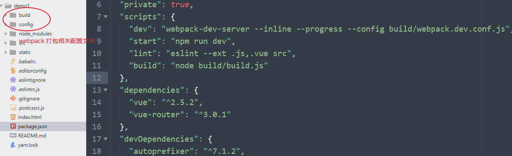
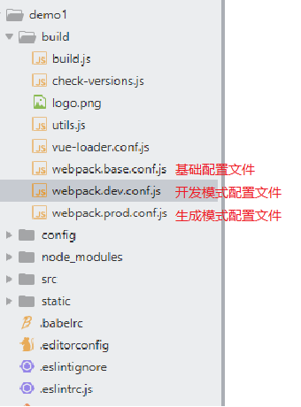

# 第9章 Vue CLI

[Vue CLI](https://cli.vuejs.org/) 是 Vue 的脚手架工具，它可以帮助我们快速生成 Vue 基础项目代码，提供开箱即用的功能特性。

- 基础代码目录结构
- 开发服务
- 本地调试
- 代码部署
- 热加载
- 单元测试
- ...


- 官方文档：https://cli.vuejs.org/
- GitHub：https://github.com/vuejs/vue-cli


### 版本

- Vue CLI 2.x（更适合学习）
  - 保留了很多的配置项，非常适合自定义
- Vue CLI 3.x
  - 更傻瓜化了，用户体验更好了
  - 目前还处于开发阶段，还没有正式发布
  - 但是 GitHub 仓库首页已经直接指向 dev 版本了

## 开始

安装：

```bash
npm install -g @vue/cli
# OR
yarn global add @vue/cli
```

初始化：

```bash
vue create my-project
```


选择 default，然后等待安装


继续等待...


安装成功。

> 最后会提示你使用 cd 命令进入刚刚创建生成的项目中。
>
> 然后让你执行 yarn serve（如果没有安装 yarn，则这里是 npm） 去启动你的项目。

启动开发模式：

```bash
npm serve
```


等待启动开发服务。。。


启动开发服务成功。

然后打开浏览器，访问提示的地址。


如果能看到这一的一个页面，则正面初始化创建成功了。

## 目录结构


| 名称              | 说明                                                |
| ----------------- | --------------------------------------------------- |
| node_modules      | 第三方包存储目录                                    |
| public            | 静态资源，已被托管                                  |
| src               | 源代码                                              |
| .gitignore        | git忽略文件，暂时不关心，我们还没有在项目中使用 git |
| babel.config.js   | 先不关心                                            |
| package.json      | 包说明文件                                          |
| README.md         | 项目的说明文本文件                                  |
| package-lock.json | 包的版本锁定文件                                    |

### src 目录结构

###  main.js


## 组件化构建模型图

## .vue 单文件组件

## ECMAScript 6 Module

## `npm run dev`



- `package.json`
- `scripts`
- dev

```bash
# --inline 行内输出提示信息
# --progress 显示打包进度条
# --config 用来指定打包的配置文件
webpack-dev-server --inline --progress --config build/webpack.dev.conf.js
```



开发的时候：

```bash
# 使用的是 base + dev 配置文件
npm run dev
```

打包发布的时候：

```bash
# 使用的是 base + prod
npm run build
```

## 模块化

> http://es6.ruanyifeng.com/#docs/module