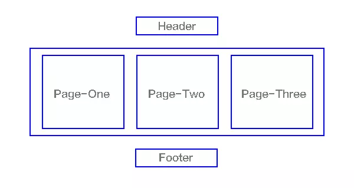

# 第10章 预热案例

- 单页面应用程序
- Vue
- Vue CLI
- axios
  - Vue 本身不提供 ajax 封装请求
  - 我们可以使用原生 XHR
  - 也可以使用jQuery 的 ajax（没必要，浪费）
  - 我们推荐更纯粹的 axios（这个库只封装了 ajax 操作）
- Vue Router 
- 模块化（ECMAScript 6 Module）
  - import
  - export
- 组件化

## 使用 Vue CLI 创建项目案例

```bash
vue create 项目名称
```

## 使用 Vue Router

安装

```bash
npm install vue-router
```

创建 `router/index.js` 并写入以下代码

```javascript
import VueRouter from 'vue-router'
import Vue from 'vue'

Vue.use(VueRouter)

// import Foo from '../views/Foo/index.vue'
import Foo from '../views/foo' // 如果加载的是一个目录，则默认加载其中的 index.xxx（js、vue） 文件
import Bar from '../views/bar'

export default new VueRouter({
  routes: [ // routes 用于配置路由表，当访问 xxx 路径的时候，展示 xxx 组件
    { path: '/foo', component: Foo },
    { path: '/bar', component: Bar }
  ]
})
```

在 `main.js` 中挂在路由实例到 Vue 实例中

```javascript
...
```


## 接口服务

打开资料中的 `api-server`，双击运行 `双击启动接口服务.bat` 文件启动接口服务，接口服务默认占用 `3000` 端口号。

如果看到如下输出则说明启动成功。


> 注意：在使用接口期间不要关闭这个命令行窗口

### 获取内容列表

- 请求地址 `/posts`
- 请求方法 `GET`

示例


### 添加内容

- 请求路径 `/posts`
- 请求方法 `POST`
- 请求参数

```json
{
  "title": "hello world",
  "content": "测试内容"
}
```


示例


### 删除内容

- 请求路径 `/posts/数据id`
- 请求方法 `DELETE`

示例


### 根据id获取单个内容

- 请求路径 `/posts/数据id`
- 请求方法 `GET`

示例


### 编辑内容

- 请求路径 `/posts/数据id`
- 请求方法 `PATCH`
- 请求参数

```json
{
  "title": "标题",
  "content": "内容"
}
```

示例


## 单页面应用程序

### 概念

传统的多页面网站应用交互模型


单页Web应用（single page web application，SPA），就是只有一张Web页面的应用，是加载单个HTML 页面并在用户与应用程序交互时动态更新该页面的Web应用程序。




### 优点

- 非常适合前后端分离开发
  - 人员职责
    - 后端负责处理数据，提供接口
    - 前端负责页面，调用接口使用数据
  - 项目工程
    - 服务端接口项目工程
    - 前端页面项目工程
- 响应速度快，用户体验好
  - 页面切换的时候，保留公共部分，展示不同的页面内容


1. 分离前后端关注点，前端负责界面显示，后端负责数据存储和计算，各司其职，不会把前后端的逻辑混杂在一起；
2. 减轻服务器压力，服务器只用出数据就可以，不用管展示逻辑和页面合成，吞吐能力会提高几倍
3. 同一套后端程序代码，不用修改就可以用于Web界面、手机、平板等多种客户端；


### 缺点


2、前进、后退、地址栏等，需要程序进行管理；
3、书签，需要程序来提供支持；


- 不利于 SEO （搜索引擎优化）
- 初次加载耗时较多
  - 单页应用有两种加载方式
  - 方式一：用户请求页面的时候，把所有的页面（组件）资源都下载下来，完了切换页面的时候速度就非常快，第一次慢一点，以后就很快了
  - 方式二：用户请求的页面的时候，只加载公共资源和当前页面资源，其它页面（组件）资源只在查看需要的时候才异步请求下载
  - 如果页面比较少，推荐第一种方式，如果页面比较多，推荐第二种方式
- 前进、后退、地址栏等，需要程序进行管理
  - hash
  - HTML5 history
  - Vue Router 都解决了


- 缺点：不利于 SEO 优化
  - 能不能解决？可以。
  - 更高级的一个概念：前后端同构
  - Vue 提供了一个服务端渲染解决方案：Vue Server Renderers（不是非常的成熟），使用成本非常高
    - 能让你在 Node 创建的 Web 服务中把 Vue 当做模板引擎来使用
  - 说白了就是服务端渲染结合单页面渲染的特点，既能拥有 SEO 优化，还能保持单页面应用的优点。
- 适合开发后台管理系统、移动端页面（交互方式就像访问原生 App 一样）

### 单页面导航路径

- 概念
- 路径
  - 一般使用锚点，也就是 hash 作为页面导航的路径标识
  - 为什么？因为正常的 url 地址会发请求，而 hash 锚点不会发请求刷新页面
- VueRouter 内部监视了 hash  的改变
  - window.onhashchange
- 然后根据 hash  的改变去展示路由规则中配置的组件
- Vue Router 默认要求  hash 导航路径都以 #/ 开头
  - 为什么？
  - 主要是为了和正常的 hash 锚点（网页内部定位，id）作区别
  - 例如我们使用锚点内部定位的时候，需要给元素起 id，我们几乎不会给这个id起名为 /xxx
  - 如果 VueRouter 没有 #/ 的规则，例如直接 #foo 就可能会和你锚点的那个 id foo 冲突。

有人会说，能不能让 url 漂亮点儿，不要使用 hash 呢？

可以。

我们可以利用 HTML5 history 的的方式使用传统的 url。（我们可以用 JavaScript 代码控制 url）。

- VueRouter 默认是 hash 路径模式
- 它也支持传统的 url 模式（HTML5 history）https://router.vuejs.org/zh/guide/#html
  - 需要额外的服务器配置


### 相关链接

- [单页应用有那些优缺点？](https://www.zhihu.com/question/20792064)
- https://juejin.im/post/5a0ea4ec6fb9a0450407725c

## 功能实现

### 列表

### 删除

### 添加

### 编辑

## 总结

