# 第11章 综合案例

## 介绍

### 做什么

> 一个前后端分离的电商B端管理系统
>
> - 我们主要做客户端
> - 服务端有准备的接口

### 技术栈

- Vue.js
- Vue CLI
- Vue Router
- ELementUI
- axios
- 组件化 + 模块化

### 案例演示

### 案例收获

- 掌握使用 Vue 全家桶开发一个中小型管理系统

## 零、准备

### 部署 API 接口服务

> 为了我们学习方便，建议大家把接口服务部署到自己的本地。
>
> 实际工作中不需要，一般后端开发人员会把接口部署到本地局域网或者线上给你使用。

1. 将接口服务项目下载到本地

```bash
git clone https://github.com/lipengzhou/shop-api.git
```

2. 创建一个数据库命名为 `shop`

3. 将 `shop-api/shop.sql` 导入 `shop` 数据库中

4. 将 `shop-api/config/default.json` 文件中的数据库连接信息 `db_config` 修改为自己的

5. 安装第三方包并启动 API 服务

```bash
cd shop-api

# 或者 yarn install
npm install
```

> 注意：使用 yarn 安装依赖的时候不要使用淘宝的镜像源，否则可能会导致安装失败
>
> 取消淘宝镜像源的方式是删除 `c:/Users/你的用户名/.npmrc` 文件即可

最后，双击 `双击启动接口服务.bat` 文件，启动接口服务，如果看到如下提示信息则说明部署启动成功。


> 注意：使用接口期间请确保这个命令行处理开启状态
>

### 部署预览完整版客户端

> 为了方便学习，建议将完整版客户端包括完整的功能和源代码。

```bash
# 下载源码到本地
git clone https://gitee.com/lipengzhou/shop-admin-dist.git

# 进入项目中
cd shop-amdin-dist

# 或者 yarn install
npm install

# 或者 yarn start
npm start
```

执行完 `yarn start` 命令之后会看到如下提示：

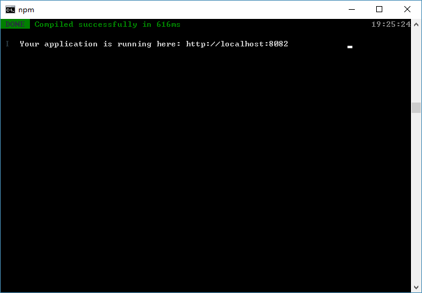

> 执行 `yarn start` 命令之后默认开启的服务占用的端口号是 `8080`，如果 8080 被占用，则会 +1 依次向后使用，例如 8081、8082、8083...，以终端提示为准。

打开浏览器访问终端中给出的服务地址。

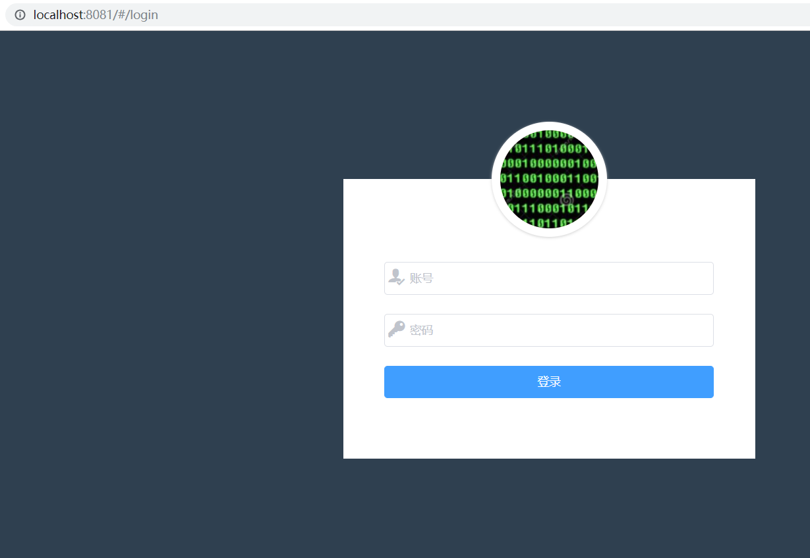

> 测试账号
>
> 用户名：admin
>
> 密码：123456

### API 接口文档

- 在线地址：[http://shopapi.lipengzhou.com/](http://shopapi.lipengzhou.com/)
- 文档仓库地址：https://github.com/lipengzhou/shop-api-doc
  - 如果需要可以自行下载本地查看


### Postman 接口测试工具

- 是什么，解决什么问题
  + 官网：https://www.getpostman.com/
- 下载安装
- 使用

### Yarn

[Yarn](https://yarnpkg.com/) 是 Facebook 工程师开发的一个类似于 [npm](https://www.npmjs.com/) 的包管理工具。相比 npm ，Yarn 号称具有更好的功能特性。

- 快速
  + 并行下载
  + Yarn 会缓存它下载的每个包，所以无需重复下载
- 可靠
  + Yarn会在每个安装包被执行前校验其完整性。
- 安全
  + Yarn 使用格式详尽而又简洁的 lockfile文件 和确定性算法来安装依赖，能够保证在一个系统上的运行的安装过程也会以同样的方式运行在其他系统上。

下载及安装：

> https://yarnpkg.com/zh-Hans/docs/install

像使用 npm 一样来使用 yarn：

```bash
# npm init
yarn init

# npm init -y
yarn init -y

# npm install 包名
yarn add 包名

# npm install 包名@版本号
yarn add 包名@版本号

# npm uninstall 包名
yarn remove 包名

# npm install
yarn install 或者 yarn

# npm install --global 包名
yarn global add 包名

# npm uninstall --global 包名
yarn global remove 包名
```

> 使用 yarn 管理第三方包会在项目目录中生成一个 `yarn.lock`，它的作用类似于 `package-lock.json`

> 警告：建议在项目中只使用一种包管理工具，或者 npm 或者 yarn，不要两者混合使用，否则会导致包的混乱及重复安装反而降低了效率。
>
> 如果想在你的半拉子项目中切换另一个工具，那就把 node_moudles 删除再使用另一个工具全部安装一下。

---

## 一、项目初始化

### 使用 Vue CLI 初始化项目

```bash
# 如果已经安装过了则不需要重新安装
npm install -g @vue/cli

vue create shop-admin-65
```

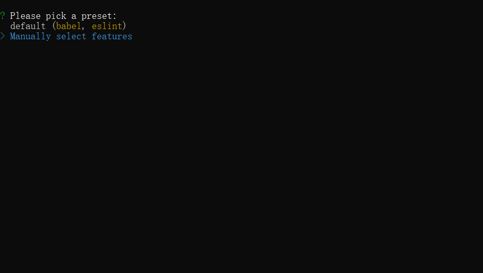

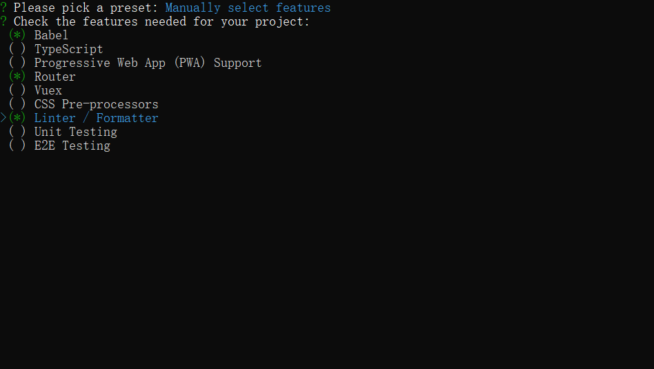

> Babel 是一个插件，它能把 ECMAScript 6 代码转成 ECMAScript 5 ，从而可以在低版本浏览器运行。
>
> Router 就是 Vue Router
>
> Linter / Formatter 就是代码格式校验工具

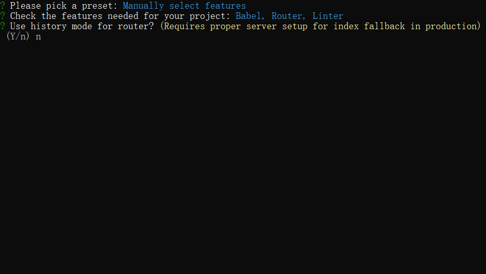

> 这里就是问你使用传统的 url 路由路径还是使用 hash 路由路径
>
> Y 就是使用传统的 url 路径（非hash），更简洁漂亮，但是需要做额外的服务器配置，兼容性不好。
>
> n 使用 hash 路径，简单直接，不需要任何配置，兼容性好。
>
> 输入 y 或者 n 敲回车进入下一步。

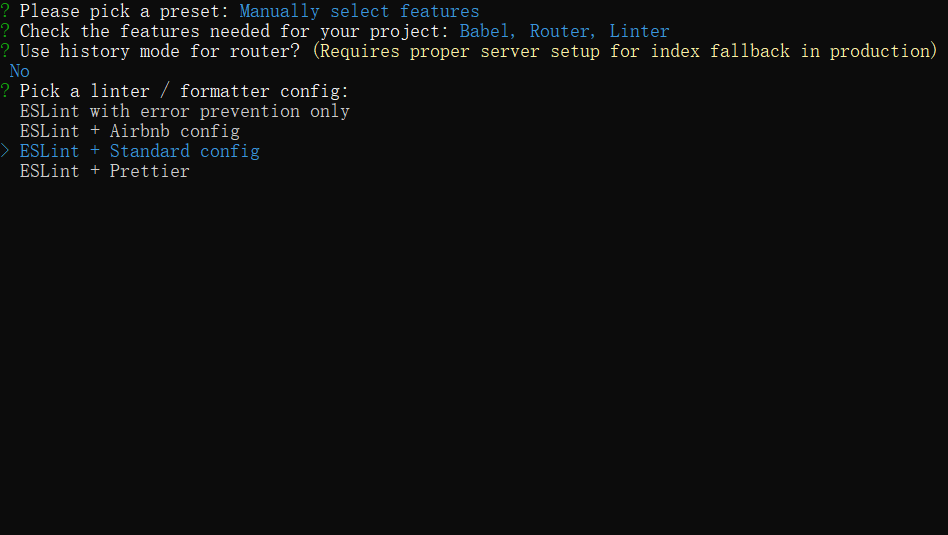

> 选择与校验工具配合的校验规则。
>
> Airbnb JavaScript Style：规则太多，使用麻烦，很多使用者需要单独去定制
>
> JavaScript Standard Style：规则刚好够用，不需要做太多修改
>
> Prettier：这是一个规则+格式化的工具，暂时不考虑
>
> 规则是人定的，在符合大多数人的习惯的情况下可以做自定义修改。

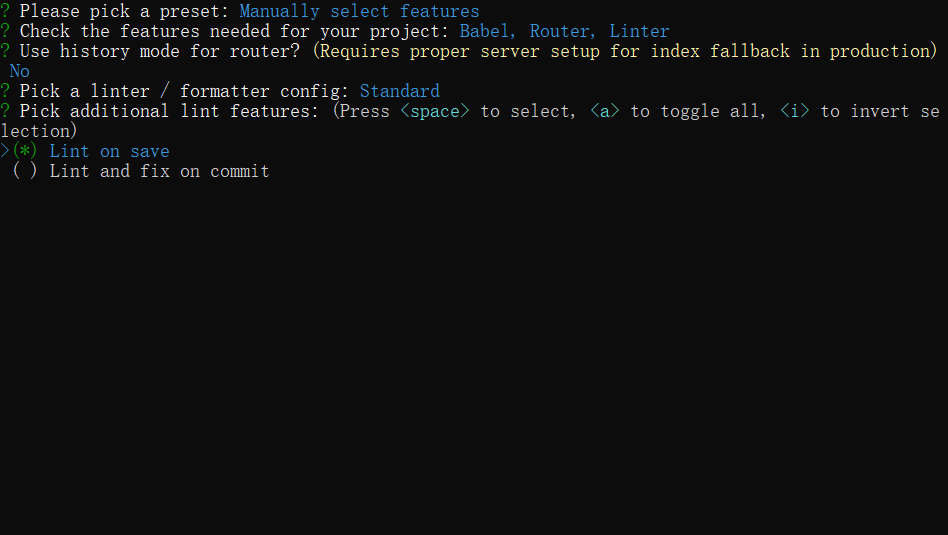

> 第1个选项表示每次保存文件的时候，自动校验代码格式
>
> 第2个选项表示只有当你使用 git commit 提交代码的时候才进行代码格式校验
>
> 这里我们选择第1个，有错及时改

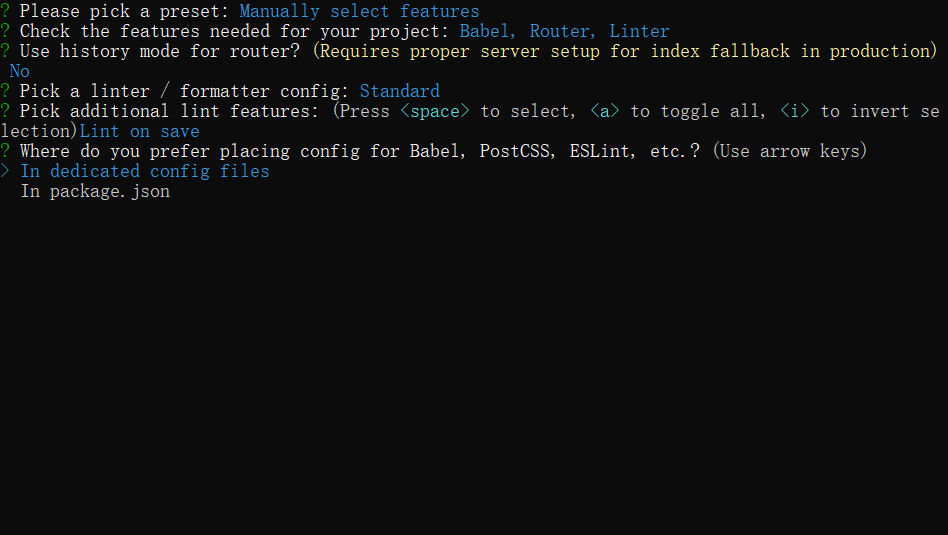

> Vue CLI 会安装一些插件，而插件有自己的配置文件
>
> 第1个选项意思是把插件的配置文件生成到单独的文件中
>
> 第2选项意思是把插件的配置生成到 package.json 文件中
>
> 建议选择第1种，单独生成插件的配置文件，不和 package.json 文件混在一起。
>
> 因为我们可能需要对某个插件进行单独的配置，所以建议插件的配置生成单独的配置文件。

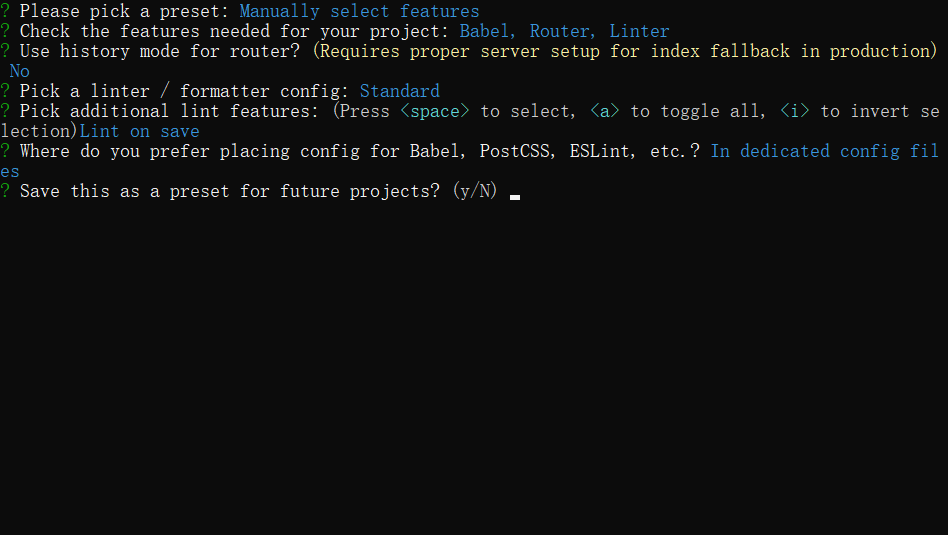

> 这里就是问你是否将我们刚才一系列的选择保存为一个定制项（就是你每一步选的啥都存起来了）。
>
> 如果保存了定制项，则下一次生成项目的时候可以快速的选择这个定制项，一步完成跟这里一模一样的选择配置。

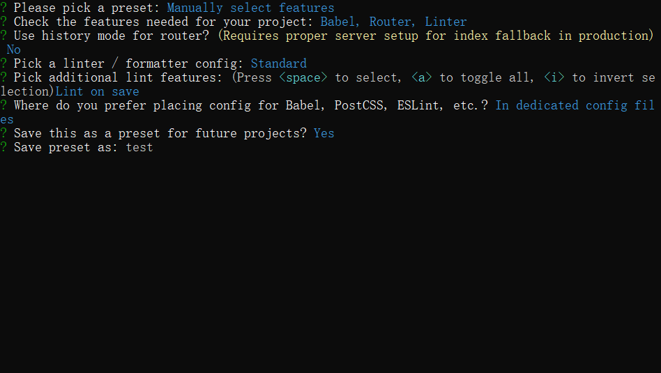

> 例如我这里需要让它记住这个定制项，输入 y ，然后它会让你给这个定制项起个名字。

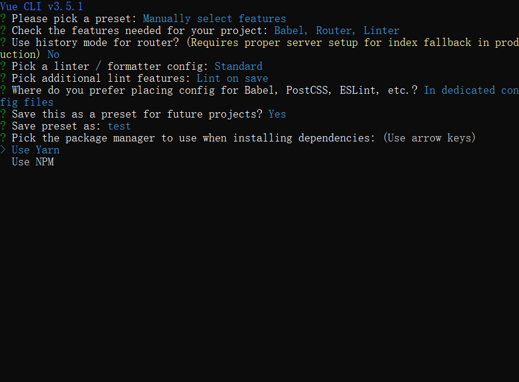

> 第1个选项使用 yarn 作为包管理工具
>
> 第2个选项使用 npm 作为包管理工具
>
> 根据自己的需要选择一个。
>
> 如果没有安装  yarn，这里就直接使用 npm 作为包管理工具了。

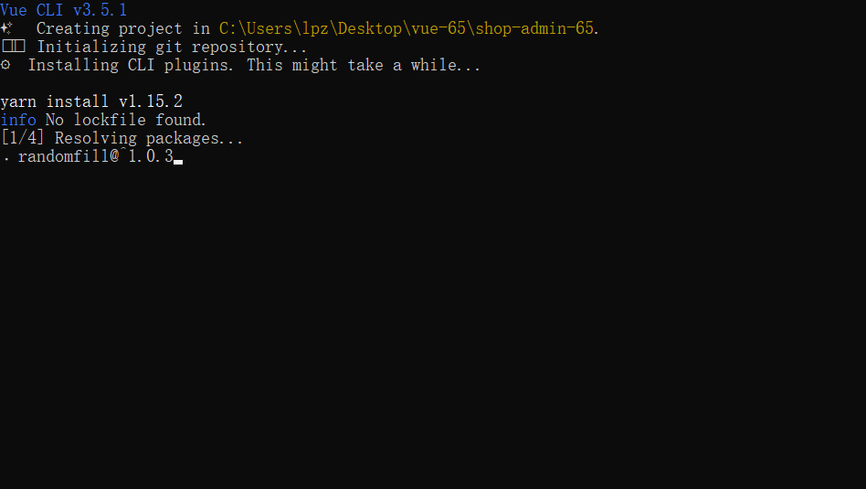

> 经过一些列配置选择之后，它就开始自动装包。
>

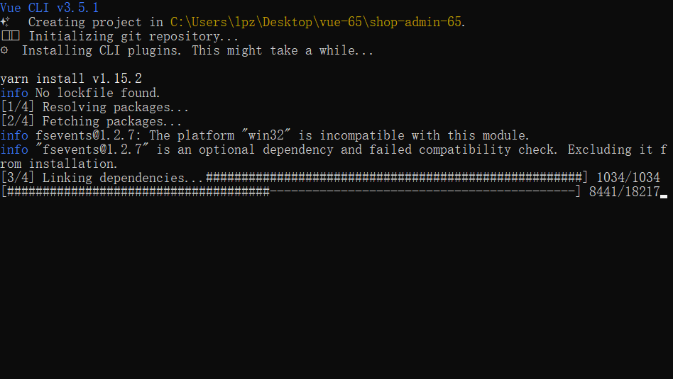

> 等待...
>
> 提示：如果装包的过程长时间不动，建议 `Ctrl + C` 打断安装，自己手动在该项目中执行 `npm install`

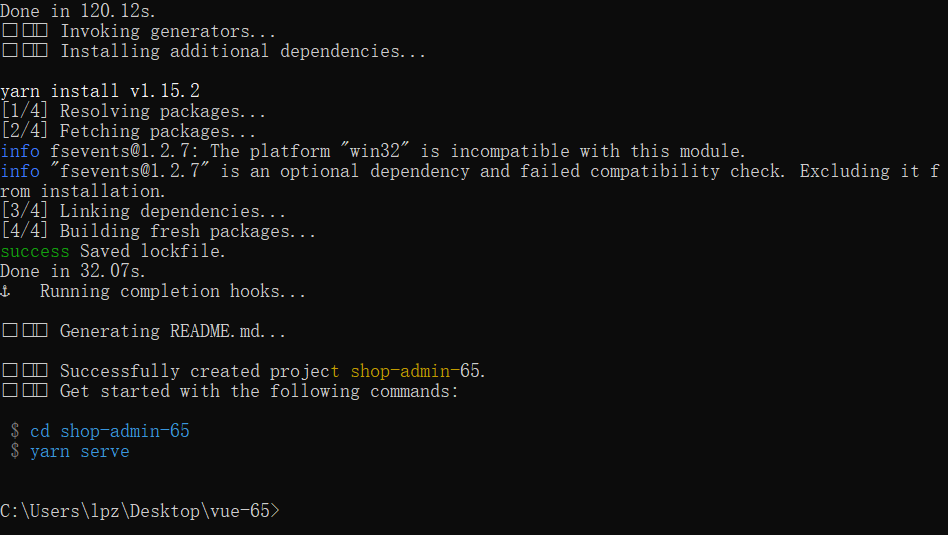

> 看到这样的提示，就证明初始化成功了。

然后按照提示，执行

```bash
cd 项目

# 或者 npm run serve
yarn serve
```

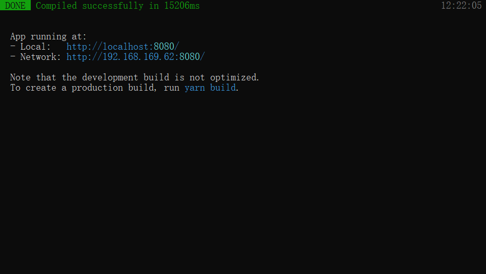

> 表示启动成功。

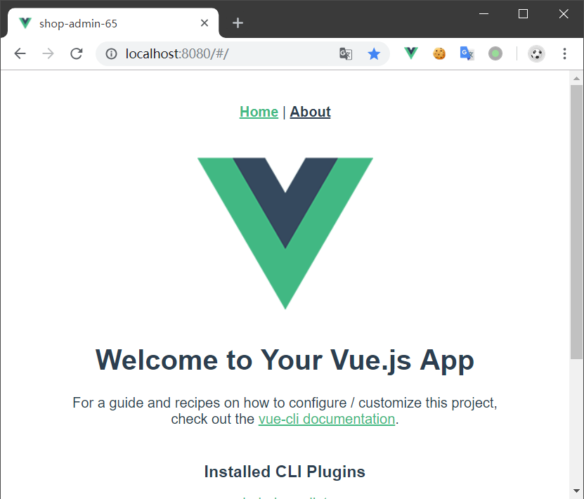

> 最后在浏览器中访问给出的地址。


### 项目结构介绍

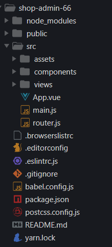

- node_modules 第三方包存储目录
- public 托管的静态资源目录
- src 源码
  - assets 静态静态
  - components 公共组件存储目录
  - views 路由组件存储目录
  - App.vue 根组件
  - main.js 启动入口
  - router.js 路由文件
- .browserlistrc 插件相关配置文件
- .editorconfig 插件相关配置文件
- .eslintrc.js 代码校验器相关配置文件
  - 例如想要修改代码校验规则可以去这个文件中进行修改
- .gitignore git的忽略配置文件
- babel.config.js babel相关的配置文件
  - babel 可以把 ECMAScript6 转成 es5
- package.json 包说明文件，包含项目名称、依赖信息等数据
- postcss.config.js 插件相关配置文件
- README.md 请读我
- yarn.lock 类似于 package-lock.json 文件


### 程序的启动

- 找到 main.js
  - 加载 App.vue 根组件
  - 配置路由到程序中
- 将 App.vue 替换到入口节点
- 当请求 / 就展示 Home 组件
- 当请求 /about 就展示 About 组件

### 代码规范

我们的项目采用 [JavaScript Standard Style](https://standardjs.com/) 代码风格，以下是一些基本规范细则。

- **使用两个空格** – 进行缩进
- **字符串使用单引号** – 需要转义的地方除外
- **不再有冗余的变量** – 这是导致 *大量* bug 的源头!
- **无分号** – [这](http://blog.izs.me/post/2353458699/an-open-letter-to-javascript-leaders-regarding)[没什么不好。](http://inimino.org/~inimino/blog/javascript_semicolons)[不骗你！](https://www.youtube.com/watch?v=gsfbh17Ax9I)
- 行首不要以 `(`, `[`, or ``` 开头
  - 这是省略分号时**唯一**会造成问题的地方 – *工具里已加了自动检测！*
  - [详情](https://github.com/standard/standard/blob/master/docs/RULES-zhcn.md#semicolons)
- **关键字后加空格** `if (condition) { ... }`
- **函数名后加空格** `function name (arg) { ... }`
- 坚持使用全等 `===` 摒弃 `==` 一但在需要检查 `null || undefined` 时可以使用 `obj == null`。
- 一定要处理 Node.js 中错误回调传递进来的 `err` 参数。
- 使用浏览器全局变量时加上 `window` 前缀 – `document` 和 `navigator` 除外
  - 避免无意中使用到了这些命名看上去很普通的全局变量， `open`, `length`, `event` 还有 `name`。

说了那么多，看看[这个遵循了 Standard 规范的示例文件](https://github.com/expressjs/body-parser/blob/master/index.js) 中的代码吧。或者，这里还有[一大波使用了此规范的项目](https://raw.githubusercontent.com/standard/standard-packages/master/all.json) 代码可供参考。

### 自定义代码规范

我们项目中所使用的 [JavaScript Standard Style]() 代码规范是由大部分开发者所认可约定的。但是也难免有些开发者不喜欢，所以说规范虽然是死的，但是人是活的，我们可以按照自己的喜欢对原有规范做一些适当调整用以满足我们自己的风格。

我们可以通过修改 ESLint 的配置文件 `.eslintrc.js` 中的 `rules` 来修改定制自己的规则。

```js
module.exports = {
  // ...
  // ...
  rules: {
    // allow async-await
    'generator-star-spacing': 'off',
    // allow debugger during development
    'no-debugger': process.env.NODE_ENV === 'production' ? 'error' : 'off'
  }
}
```

`rules` 是一个对象，其中对象的键为代码规则的代号，值为校验该规则的级别状态。

规则的校验级别状态可以被设置为：

- "off" or 0 - 关闭不校验
- "warn" or 1 - 警告
- "error" or 2 - 错误

例如我们修改校验规则必须有分号：

```js
module.exports = {
  // ...
  // ...
  rules: {
    // allow async-await
    'generator-star-spacing': 'off',
    // allow debugger during development
    'no-debugger': process.env.NODE_ENV === 'production' ? 'error' : 'off',
    'semi': ['error', 'always']
  }
}
```

完整版的校验规则列表参考，详见[官方文档 - Rules](https://eslint.org/docs/rules/)。

也可以单独设定某一段代码的校验规则：

```js
/* eslint-disable */

alert('foo');

/* eslint-enable */
```

```js
/* eslint-disable no-alert, no-console */

alert('foo');
console.log('bar');

/* eslint-enable no-alert, no-console */
```

```
alert('foo'); /* eslint-disable-line no-alert */
```

> 参考链接：
> - [Configuring Rules](https://eslint.org/docs/user-guide/configuring#configuring-rules)
> - [Disabling Rules with Inline Comments](https://eslint.org/docs/user-guide/configuring#disabling-rules-with-inline-comments)

### 加入 Git 版本控制

初始化本地仓库并完成一次提交。

```bash
git init
git status
git add --all
git commit -m ":tada: Initial commit"
```

在 GitHub 上创建一个在线仓库。

将本地项目推送到 GitHub。

```bash
git remote add origin https://github.com/你的GitHub用户名/admin-vue.git
git push -u origin master
```

## 二、从登陆开始

### 基本登陆

### 使用路由导航守卫结合 token 处理视图访问拦截

> 参考链接：
>
> - [路由 - 导航守卫](https://router.vuejs.org/zh-cn/advanced/navigation-guards.html)

```sequence
title: 基于 Token 的验证流程
participant 客户端 as client
participant 服务器 as server
client -> server: 用户名+密码
server --> client: Token 令牌
note over client: 将 Token 存储到本地
```

在 `src/components/login/script.js` 中登陆成功，将服务器下发的 `token` 保存到本地存储：

```js
// 其它代码...

handleLogin () {
  axios.post('http://localhost:8888/api/private/v1/login', this.loginForm)
    .then(res => {
      const {data, meta} = res.data
      const {msg, status} = meta

      if (status === 200) {
        // 将凭证放到到本地存储（会在路由守卫那里使用）
        window.localStorage.setItem('token', data.token)

        // 跳转到首页
        this.$router.push('/')
      } else if (status === 400) {
        window.alert(msg)
      }
    })
}

// 其它代码...
```

在 `src/router/index.js` 中，添加全局路由导航守卫对非登陆请求进行登陆权限判定：

```js
// 其它代码...

const router = new Router({
  // ...
})

router.beforeEach((to, from, next) => {
  const {path} = to
  if (path !== '/login') { // 如果请求的不是 /login 则校验登陆状态
    const token = window.localStorage.getItem('token')
    if (!token) { // 如果没有 token 则让其跳转到 /login
      next('/login')
    } else { // 有 token，让其通过
      next()
    }
  } else {
    // 如果用户请求的就是 /login 则直接调用 next() 放行
    next()
  }
})

export default router

```

### 导入 ElementUI

> 参考链接：
>
> - [Element 官网](http://element-cn.eleme.io)

安装依赖：

```bash
# 或者 npm install element-ui
yarn add element-ui
```

在 `src/main.js` 中加载并配置：

```js{4,5,7}
import Vue from 'vue'
import App from './App'
import router from './router'
import ElementUI from 'element-ui'
import 'element-ui/lib/theme-chalk/index.css'

Vue.use(ElementUI)

Vue.config.productionTip = false

/* eslint-disable no-new */
new Vue({
  el: '#app',
  router,
  components: { App },
  template: '<App/>'
})

```

### 布局登陆组件

> 参考链接：
>
> - [Element - Form表单](http://element-cn.eleme.io/#/zh-CN/component/form)

参考 Element 的 Form表单组件文档，我们先来个最简单的登陆表单。

将 `src/components/login/template.html` 文件内容替换为：

```html
<div>
  <el-form :model="loginForm">
    <el-form-item>
      <el-input v-model="loginForm.username" placeholder="用户名"></el-input>
    </el-form-item>
    <el-form-item>
      <el-input type="password" v-model="loginForm.password" placeholder="密码"></el-input>
    </el-form-item>
    <el-form-item>
      <el-button type="primary" @click="handleLogin">登陆</el-button>
    </el-form-item>
  </el-form>
</div>
```

接下来我们开始调整登陆页面的样式。

首先把公共样式写到 `src/assets/css/index.css` 文件中。

```css
html, body, #app {
  width: 100%;
  height: 100%;
}

body {
  margin: 0;
  padding: 0;
}

```

然后在 `src/main.js` 加载：

```javascript
// 代码略...

// 引入我们的公共样式
import './assets/css/index.css'

// 代码略...

```

最后，我们分别调整登陆组件的HTML结构、及CSS样式：

`src/components/login/template.html`:

```html
<div class="login-wrap">
  <div class="login-form">
    <el-form :model="loginForm">
      <el-form-item>
        <el-input v-model="loginForm.username" placeholder="用户名"></el-input>
      </el-form-item>
      <el-form-item>
        <el-input type="password" v-model="loginForm.password" placeholder="密码"></el-input>
      </el-form-item>
      <el-form-item>
        <el-button class="login-submit" type="primary" @click="handleLogin">登陆</el-button>
      </el-form-item>
    </el-form>
  </div>
</div>

```

`src/components/login/style.css`:

```css
.login-wrap {
  width: 100%;
  height: 100%;
  background-color: #2d434c;
  display: flex;
  justify-content: center;
  align-items: center;
}

.login-wrap .login-form {
  background-color: #fff;
  padding: 50px 50px 20px 50px;
  width: 25%;
}

.login-wrap .login-form .login-submit {
  width: 100%;
}

```

### 为登陆组件加入表单验证

1. 为表单中需要验证的表单项 `el-form-item` 声明 `prop` 属性，属性值给一个有意义的名称

```html{4,7}
<div class="login-wrap">
  <div class="login-form">
    <el-form :model="loginForm">
      <el-form-item prop="username">
        <el-input v-model="loginForm.username" placeholder="用户名"></el-input>
      </el-form-item>
      <el-form-item prop="password">
        <el-input type="password" v-model="loginForm.password" placeholder="密码"></el-input>
      </el-form-item>
      <el-form-item>
        <el-button class="login-submit" type="primary" @click="handleLogin">登陆</el-button>
      </el-form-item>
    </el-form>
  </div>
</div>
```

2. 在组件的 `data` 中增加一个属性对象 `loginFormRule` 配置 `prop` 字段属性的验证规则

```js{11,12,13,14,15,16,17,18}
import axios from 'axios'

export default {
  // ... 代码略
  data () {
    return {
      loginForm: {
        username: '',
        password: ''
      },
      loginFormRule: {
        username: [
          { required: true, message: '请输入用户名', trigger: 'blur' }
        ],
        password: [
          { required: true, message: '请输入密码', trigger: 'blur' }
        ]
      }
    }
  },
  // ... 代码略
}

```

3. 在登陆组件的模板中为 `el-form` 表单组件绑定 `rules` 属性到 `data` 中定义的 `loginFormRule`

```html{3}
<div class="login-wrap">
  <div class="login-form">
    <el-form :model="loginForm" :rules="loginFormRule">
    ... 代码略
```

4. 测试验证是否成功

我们在前面做的 1 - 4 步已经完成了基本的表单验证功能。接下来我们要在表单提交登陆发起请求的时候使用 JavaScript 校验是否通过表单验证，表单验证通过再去提交表单。

首先为登陆组件模板的 `el-form` 组件声明 `ref` 属性，属性值给一个有意义的名字。

```html{3}
<div class="login-wrap">
  <div class="login-form">
    <el-form ref="form" :model="loginForm" :rules="loginFormRule">
    ... 代码略
```

然后在表单提交的时候调用 JavaScript 判断表单验证是否通过，通过再发起登陆请求。

```js{8}
import axios from 'axios'

export default {
  // ... 代码略
  methods: {
    handleLogin () {
      // ['form'] 中的 form 就是 el-form 标签 ref 属性值
      this.$refs['form'].validate((valid) => {
        if (!valid) {
          return
        }
        axios.post('http://localhost:8888/api/private/v1/login', this.loginForm)
          .then(res => {
            const {data, meta} = res.data
            const {msg, status} = meta
            if (status === 200) {
              // 将凭证放到到本地存储（会在路由守卫那里使用）
              window.localStorage.setItem('token', data.token)

              // 跳转到首页
              this.$router.push('/')
            } else if (status === 400) {
              window.alert(msg)
            }
          })
      })
    }
  }
  // ... 代码略
}

```

### 使用 Message 消息提示给出操作反馈

无论登陆成功还是登陆失败，我们都应该给出用户一个友好的提示。这里我们可以使用 Element 提供的 [Message 消息提示](http://element-cn.eleme.io/#/zh-CN/component/message) 组件来很方便的实现。

```js{23,28}
import axios from 'axios'

export default {
  // ... 代码略
  methods: {
    handleLogin () {
      // ['form'] 中的 form 就是 el-form 标签 ref 属性值
      this.$refs['form'].validate((valid) => {
        if (!valid) {
          return
        }
        axios.post('http://localhost:8888/api/private/v1/login', this.loginForm)
          .then(res => {
            const {data, meta} = res.data
            const {msg, status} = meta
            if (status === 200) {
              // 将凭证放到到本地存储（会在路由守卫那里使用）
              window.localStorage.setItem('token', data.token)

              // 跳转到首页
              this.$router.push('/')

              this.$message({
                message: '登陆成功',
                type: 'success'
              })
            } else if (status === 400) {
              this.$message.error(msg)
            }
          })
      })
    }
  }
  // ... 代码略
}

```

## 三、Home 组件处理

### 布局 Home 组件基本结构

这里我们可以使用 Element 组件库中的 [Container 布局容器](http://element.eleme.io/#/zh-CN/component/container) 实现基本结构。

`src/components/home/home.vue`：

```html
<template>
  <el-container class="container">
    <el-header class="header">Header</el-header>
    <el-container class="container">
      <el-aside class="aside" width="200px">Aside</el-aside>
      <el-main class="main">Main</el-main>
    </el-container>
  </el-container>
</template>

<script>
export default {
  data () {
    return {}
  }
}
</script>

<style>
.header {
  background-color: #b3c1cd;
}

.container, .aside, .main, .aside .nav-menu {
  height: 100%;
}

.aside {
  background-color: #d4dfe4;
}

.main {
  background-color: #eaeef1;
}
</style>
```

### 布局侧边栏

`src/components/home/home.vue`：

```html
<template>
<el-container class="container">
  <el-header class="header">Header</el-header>
  <el-container class="container">
    <el-aside class="aside" width="200px">
      <el-menu
        default-active="2"
        class="nav-menu"
        unique-opened="true"
        @open="handleOpen"
        @close="handleClose"
        background-color="#545c64"
        text-color="#fff"
        active-text-color="#ffd04b">
        <el-submenu index="1">
          <template slot="title">
            <i class="el-icon-location"></i>
            <span>用户管理</span>
          </template>
          <el-menu-item index="1-1">用户列表</el-menu-item>
        </el-submenu>
        <el-submenu index="2">
          <template slot="title">
            <i class="el-icon-location"></i>
            <span>权限管理</span>
          </template>
          <el-menu-item index="2-1">角色列表</el-menu-item>
          <el-menu-item index="2-2">权限列表</el-menu-item>
        </el-submenu>
        <el-submenu index="3">
          <template slot="title">
            <i class="el-icon-location"></i>
            <span>商品管理</span>
          </template>
          <el-menu-item index="3-1">商品列表</el-menu-item>
          <el-menu-item index="3-2">分类参数</el-menu-item>
          <el-menu-item index="3-3">商品分类</el-menu-item>
        </el-submenu>
        <el-submenu index="4">
          <template slot="title">
            <i class="el-icon-location"></i>
            <span>订单管理</span>
          </template>
          <el-menu-item index="4-1">订单列表</el-menu-item>
        </el-submenu>
        <el-submenu index="5">
          <template slot="title">
            <i class="el-icon-location"></i>
            <span>数据统计</span>
          </template>
          <el-menu-item index="5-1">数据报表</el-menu-item>
        </el-submenu>
      </el-menu>
    </el-aside>
    <el-main class="main">Main</el-main>
  </el-container>
</el-container>
</template>
```

### 布局 Header 头部

这里我们使用的是 Element 组件库自带的 [Layout 布局](http://element.eleme.io/#/zh-CN/component/layout) 来完成 Header 组件基本样式结构。

```html
<template>
<el-container class="container">
  <el-header class="header">
    <el-row>
      <el-col :span="4">
        
      </el-col>
      <el-col :span="16">电商后台管理系统</el-col>
      <el-col :span="4">
        <a href="#">退出</a>
      </el-col>
    </el-row>
  </el-header>
  ... 代码略
```

### 处理用户退出

首先为顶部的退出按钮注册一个点击事件处理函数：

```html
<el-container class="container">
  <el-header class="header">
    <el-row>
      <el-col :span="4">
        
      </el-col>
      <el-col :span="16">电商后台管理系统</el-col>
      <el-col :span="4">
        <a @click.prevent="handleLogout" href="#">退出</a>
      </el-col>
    </el-row>
  </el-header>
  ... 代码略
```

`methods` 中 `handleLogout` 具体实现：

```javascript
// ... 代码略
handleLogout () {
  this.$confirm('确认退出吗？', '退出提示', {
    confirmButtonText: '确定',
    cancelButtonText: '取消',
    type: 'warning'
  }).then(() => { // 用户点击 确定 执行这里
    // 1. 删除本地存储中的 token，也就是清除登陆状态
    window.localStorage.removeItem('token')

    // 2. 跳转到 /login
    this.$router.push('/login')

    this.$message({
      type: 'success',
      message: '退出成功!'
    })
  }).catch(() => { // 用户点击 取消 执行这里
    this.$message({
      type: 'info',
      message: '已取消退出'
    })
  })
}
// ... 代码略
```

---

## 四、用户列表

### 添加用户列表组件并配置路由表

1. 分别创建下面的四个文件

- `src/components/user-list/user-list.vue`
- `src/components/user-list/template.html`
- `src/components/user-list/script.js`
- `src/components/user-list/style.css`

`src/components/user-list/template.html`:

```html
<div>
  <p>user-list component</p>
</div>
```

`src/components/user-list/user-list.vue`:

```html
<template src="./template.html"></template>
<script src="./script.js"></script>
<style src="./style.css"></style>

```

2. 配置路由表

`src/router/index.js`:

```js{12-17}
// ... 代码略

const router = new Router({
  routes: [
    {
      path: '/',
      component: Home,
      // 当渲染 children 组件的时候会先把 Home 组件渲染出来
      // Home 组件找到根组件中的 router-view 出口替换渲染
      // Home 组件的 children 子路由会渲染到 Home 组件内部的 router-view 出口
      // 参考文档：https://router.vuejs.org/zh-cn/essentials/nested-routes.html
      children: [
        {
          path: '/users',
          component: UserList
        }
      ]
    },
    {
      path: '/login',
      component: Login
    }
  ]
})

// ... 代码略

```

3. 访问 `/users` 测试。

### 在用户列表中使用表格组件

> 参考链接：
>
> - [Element - Table 表格](http://element.eleme.io/#/zh-CN/component/table)

`src/components/user-list/template.html`:

```html
<div>
<!--
  表格组件的使用：
  el-table 组件
    data 用来绑定表格数据，是一个数组
    表格组件会根据 data 自动循环渲染
  el-table-column 组件就是表格列
    label 属性用来指定列的标题
    prop 属性用来指定 data 数组中元素项的某个属性
    width 用来设定表格列的宽度，默认单位是 px
 -->
<el-table
  :data="tableData"
  style="width: 100%">
  <el-table-column
    prop="date"
    label="日期"
    width="180">
  </el-table-column>
  <el-table-column
    prop="name"
    label="姓名"
    width="180">
  </el-table-column>
  <el-table-column
    prop="address"
    label="地址">
  </el-table-column>
</el-table>
</div>
```

`src/components/user-list/script.js`:

```js
export default {
  data() {
    return {
      tableData: [{
        date: '2016-05-02',
        name: '王小虎',
        address: '上海市普陀区金沙江路 1518 弄'
      }, {
        date: '2016-05-04',
        name: '王小虎',
        address: '上海市普陀区金沙江路 1517 弄'
      }, {
        date: '2016-05-01',
        name: '王小虎',
        address: '上海市普陀区金沙江路 1519 弄'
      }, {
        date: '2016-05-03',
        name: '王小虎',
        address: '上海市普陀区金沙江路 1516 弄'
      }]
    }
  }
}
```

### 在请求头中加入 token 请求用户列表

`src/components/user-list/script.js`

```js
import axios from 'axios'

export default {
  // ... 代码略

  created () {
    // 1. 除了登陆接口，其它接口都需要 token 认证
    // 2. 我们要做的就是按照服务器接口的要求，把 token 放到请求头的 Authorization 字段中
    // 3. 对于接口中的查询字符串，我们可以通过 axios 请求的可选参数 params 来指定传递
    //    params 对象就类似于我们之前使用的 $.ajax 中的 data 选项
    //    params 对象最终会被转换为 key=value&key=value 的格式字符串然后以 ? 分隔拼接到请求地址后面发起请求
    //    这样做的好处就是不需要我们自己去 url 中拼 ?key=value&key=value
    // 服务器 API 除了登陆的接口是可以直接请求处理
    // 其它所有的接口都必须提供登陆成功交换到的 token 发送给服务器才可以
    // 我们这里服务器接口要求必须在请求头中通过一个名字为  Authorization 字段提供 token 令牌
    axios.get('http://localhost:8888/api/private/v1/users', {
      headers: { // headers 是 axios 的 API，固定的
        // 需要授权的 API ，必须在请求头中使用 Authorization 字段提供 token 令牌
        // Authorization 是服务器接口的要求，我们不能乱写
        // 也就是说如果接口要求在头里面放一个 a 值为 token
        // 则我们就要
        //    a: window.localStorage.getItem('token')
        Authorization: window.localStorage.getItem('token')
      },
      params: { // params 可以用来指定请求的查询字符串
        pagenum: 1, // 告诉接口服务器，我要获取第 1 页的数据
        pagesize: 5 // 告诉接口服务器，每页5条数据
      }
    })
      .then(res => {
        console.log(res.data)
      })
  }

  // ... 代码略
}

```

### 将请求得到的数据更新到用户列表表格中

`src/components/user-list/template.html`:

```html{5-19}
<div>
  <el-table
    :data="tableData"
    style="width: 100%">
    <el-table-column
      prop="username"
      label="用户名"
      width="180">
    </el-table-column>
    <el-table-column
      prop="email"
      label="邮箱"
      width="180">
    </el-table-column>
    <el-table-column
      prop="mobile"
      label="电话"
      width="180">
    </el-table-column>
  </el-table>
</div>

```

`src/components/user-list/script.js`:

```js{17}
import axios from 'axios'

export default {
  created () {
    axios.get('http://localhost:8888/api/private/v1/users', {
      headers: {
        Authorization: window.localStorage.getItem('token')
      },
      params: {
        pagenum: 1,
        pagesize: 5
      }
    })
      .then(res => {
        const {data, meta} = res.data
        if (meta.status === 200) {
          this.tableData = data.users
        }
      })
  },
  data () {
    return {
      tableData: []
    }
  }
}

```

### 分页展示用户列表

`src/components/user-list/template.html`:

```html{7-13}
<div>
  <!-- 表格列表 -->
  ... 代码略
  <!-- /表格列表 -->

  <!-- 数据分页 -->
  <el-pagination
    background
    layout="prev, pager, next"
    :page-size="2"
    :total="total"
    @current-change="handleCurrentChange">
  </el-pagination>
  <!-- /数据分页 -->
</div>

```

`src/components/user-list/script.js`:

```js{6,11,15-18,20-36}
import axios from 'axios'

export default {
  created () {
    // 页码第一次加载，显示第1页数据
    this.loadUsersByPage(1)
  },
  data () {
    return {
      tableData: [],
      total: 0
    }
  },
  methods: {
    handleCurrentChange (page) {
      // 在页码改变的时候，请求加载该页码对应的数据
      this.loadUsersByPage(page)
    },

    loadUsersByPage (page) {
      axios.get('http://localhost:8888/api/private/v1/users', {
        headers: {
          Authorization: window.localStorage.getItem('token')
        },
        params: {
          pagenum: page,
          pagesize: 2
        }
      }).then(res => {
          const {data, meta} = res.data
          if (meta.status === 200) {
            this.tableData = data.users
            this.total = data.total
          }
        })
    }
  }
}

```

### 用户列表搜索

`src/components/user-list/template.html`:

```html{5}
<div>
  <el-row>
    <el-col :span="6">
      <el-input placeholder="请输入内容" v-model="searchText" class="input-with-select">
        <el-button slot="append" icon="el-icon-search" @click="handleSearch"></el-button>
      </el-input>
    </el-col>
  </el-row>
  <!-- 表格列表 -->
  ... 代码略
  <!-- /表格列表 -->

  <!-- 数据分页 -->
  ... 代码略
  <!-- /数据分页 -->
</div>

```

`src/components/user-list/script.js`:

```js{12,43-47}
import axios from 'axios'

export default {
  created () {
    // 页码第一次加载，显示第1页数据
    this.loadUsersByPage(1)
  },
  data () {
    return {
      tableData: [],
      total: 0,
      searchText: ''
    }
  },
  methods: {
    handleCurrentChange (page) {
      // 在页码改变的时候，请求加载该页码对应的数据
      this.loadUsersByPage(page)
    },

    loadUsersByPage (page) {
      axios.get('http://localhost:8888/api/private/v1/users', {
        headers: {
          Authorization: window.localStorage.getItem('token')
        },
        params: {
          pagenum: page,
          pagesize: 2,
          query: this.searchText  // query 参数可选，用来指定查询的筛选条件，这里的筛选条件是用户名
        }
      }).then(res => {
          const {data, meta} = res.data
          if (meta.status === 200) {
            this.tableData = data.users
            this.total = data.total
          }
        })
    },

    /**
     * 处理搜索
     */
    handleSearch () {
      // 点击搜索，调用请求方法加载数据列表
      // 请求方法中会去根据输入框中的内容进行搜索
      this.loadUsersByPage(1)
    }
  }
}

```

### 添加用户

`shop-admin/src/components/user-list/template.html`:

```html{14,32-51}
<div>
  <!-- 面包屑 -->
  ... 代码略
  <!-- /面包屑 -->

  <!-- 搜索 -->
  <el-row :gutter="20">
    <el-col :span="6">
      <el-input placeholder="请输入内容" v-model="searchText">
        <el-button slot="append" icon="el-icon-search" @click="handleSearch"></el-button>
      </el-input>
    </el-col>
    <el-col :span="2">
      <el-button type="primary" @click="dialogFormVisible = true">添加用户</el-button>
    </el-col>
  </el-row>
  <!-- /搜索 -->

  <!-- 表格列表 -->
  ... 代码略
  <!-- /表格列表 -->

  <!-- 数据分页 -->
  ... 代码略
  <!-- /数据分页 -->

  <!-- 添加用户对话框 -->
  <!--
    el-dialog 是对话框组件
      visible 属性需要绑定一个布尔值，对话框会根据布尔值的真假来决定显示与隐藏
   -->
  <el-dialog title="添加用户" :visible.sync="dialogFormVisible">
    <el-form ref="form" :model="addUserForm" label-position="left" size="small" :rules="formRule">
      <el-form-item label="用户名" label-width="80px" prop="username">
        <el-input v-model="addUserForm.username" auto-complete="off"></el-input>
      </el-form-item>
      <el-form-item label="密码" label-width="80px" prop="password">
        <el-input v-model="addUserForm.password" auto-complete="off"></el-input>
      </el-form-item>
      <el-form-item label="邮箱" label-width="80px" prop="email">
        <el-input v-model="addUserForm.email" auto-complete="off"></el-input>
      </el-form-item>
      <el-form-item label="电话" label-width="80px" prop="mobile">
        <el-input v-model="addUserForm.mobile" auto-complete="off"></el-input>
      </el-form-item>
    </el-form>
    <div slot="footer" class="dialog-footer">
      <el-button @click="dialogFormVisible = false">取 消</el-button>
      <el-button type="primary" @click="handleAddUser">确 定</el-button>
    </div>
  </el-dialog>
  <!-- 添加用户对话框 -->
</div>

```

`src/components/user-list/script.js`:

```js{12-34,44-66}
import axios from 'axios'

export default {
  created () {
    this.loadUsersByPage(1)
  },
  data () {
    return {
      tableData: [],
      total: 0,
      searchText: '',
      dialogFormVisible: false,
      addUserForm: {
        username: '',
        password: '',
        email: '',
        mobile: ''
      },
      formRule: {
        username: [
          {required: true, message: '请输入用户名', trigger: 'blur'}
        ],
        password: [
          {required: true, message: '请输入密码', trigger: 'blur'},
          {min: 3, max: 16, message: '密码为 3 - 16 位长度', trigger: 'blur'}
        ],
        email: [
          { required: true, message: '请输入用户名', trigger: 'blur' },
          { type: 'email', message: '请输入正确的邮箱', trigger: 'blur' }
        ],
        mobile: [
          { required: true, message: '请输入手机号', trigger: 'blur' }
        ]
      }
    }
  },
  methods: {
    // ... 代码略
    // ... 代码略

    /**
     * 添加用户
     */
    handleAddUser () {
      axios({
        method: 'post',
        url: 'http://localhost:8888/api/private/v1/users',
        data: this.addUserForm,
        headers: {
          Authorization: window.localStorage.getItem('token')
        }
      }).then(res => {
        if (res.data.meta.status === 201) {
          this.$message({
            type: 'success',
            message: '添加用户成功'
          })

          // 关闭对话框
          this.dialogFormVisible = false

          // 清空表单
          this.$refs['form'].resetFields()
        }
      })
    }

    // ... 代码略
    // ... 代码略
  }
}

```

### 修改用户状态

### 删除用户

### 编辑用户

---

## 将 axios 扩展为 Vue 插件

> 为 Vue 扩展插件：https://cn.vuejs.org/v2/guide/plugins.html

我们在使用 axios 的时候遇到了一些问题：

- 请求路径
- 每一次都要 import 载入
- 所有需要授权的 API 都要配置请求头 Token
  - 利用请求拦截器，参考文档：https://github.com/axios/axios#interceptors


在 `src/assets/js/http.js`:

```javascript
import axios from 'axios'
import {getToken} from './auth'

const http = axios.create({
  baseURL: 'http://localhost:8888/api/private/v1/'
})

// 我们这里使用 http 请求拦截器的目的是为了解决：每次请求需要授权的API手动在请求头中加 Token 令牌的问题
// 添加请求拦截器
// 拦截器的本身就是一个方法
// 该方法什么时候执行？
// 拦截器函数接收一个参数 config
// config 就是你当前请求的配置对象
// 当你使用 axios 发起请求的时候，那么就会先经过这个拦截器然后再发出请求
// 也就是说在请求拦截器内部的请求还没有发出去
// 我们可以在这里定制请求之前的行为
http.interceptors.request.use(function (config) {
  // 如果本次请求的不是 /login 接口，则我们就加入请求头
  if (config.url !== '/login') {
    config.headers['Authorization'] = getToken()
  }

  // return config 就好比 next() 允许通过
  // 通过之后才要真正的发起请求
  return config
}, function (error) { // 当请求出错的时候会调用到第二个参数函数
  // Do something with request error
  return Promise.reject(error)
})

// 建议通过定义插件的配置来扩展 Vue 本身
// 1. 定义一个插件对象
const httpPlugin = {}

// 2. 为插件对象添加一个成员：install
//    install 是一个函数
//    该函数接收两个参数：Vue、options
//
//   Vue.use(httpPlugin) 会来调用 install 方法
httpPlugin.install = function (Vue, options) {
  // 3. 添加实例方法
  Vue.prototype.$http = http
}

// 4. 导出插件对象
export default httpPlugin

// 5. 在入门文件模块 main.js 加载使插件生效
// Vue.use(httpPlugin)

```

然后在 `src/main.js` 文件中加载插件使之生效：

```javascript
// ...代码略
import httpPlugin from '@/assets/js/http'
Vue.use(httpPlugin)
// ...代码略
```

接下来我们就可以在组件中直接通过 `this.$http` 来使用 `axios` 了。

```javascript
async created () {
  // ...代码略
  const res = await this.$http.get('/users', {
    // ...代码略
  })
  // ...代码略
}
```

## 二、用户管理

1. 创建用户列表组件
2. **配路由表（重点：子路由）**
3. 处理侧边栏导航
4. 布局用户列表组件
5. 请求用户列表数据，渲染到用户列表组件
   1. 发请求，得到数据
   2. 处理数据，渲染到组件模板


### 表格列表渲染

我们可以直接在用户列表组件的 `created` 生命钩子函数中发起请求加载表格数据：

```javascript
export default {
  // ...
  async created () {
    const res = await this.$http.get('/users', {
      params: { // 请求参数，对象会被转换为 k=v&k=v 的格式，然后拼接到请求路径 ? 后面发起请求
        pagenum: 1,
        pagesize: 2
      }
    })
    const {users} = res.data.data
    this.tableData = users
  }
  // ...
}

```


### 分页处理

首先我们把接口返回的 `total` 总记录数交给分页插件帮我们完成页码分页：

```javascript
export default {
  // ...
  async created () {
    const res = await this.$http.get('/users', {
      params: { // 请求参数，对象会被转换为 k=v&k=v 的格式，然后拼接到请求路径 ? 后面发起请求
        pagenum: 1,
        pagesize: 2
      }
    })
    const {users, total} = res.data.data
    this.tableData = users
  }
  // ...
}

```

我们发现分页插件已经根据我们给定的每页大小以及总记录数完成了分页页码功能。

接下来我们来处理点击页码加载对应页码数据的功能。这里我们可以使用分页插件提供的 `current-change` 事件，在该事件处理函数中我们可以接收到分页插件传递给我们的当前页码。

```javascript
export default {
  // ...
  methods: {
    handleCurrentChange (val) { // 页码改变的时候，该函数会被调用，并得到当前页码
      const res = await this.$http.get('/users', {
        params: {
          pagenum: val, // 将当前页码传递给服务器接口
          pagesize: 2
        }
      })
      const {users, total} = res.data.data
      this.tableData = users
      this.total = total
    }
  }
  // ...
}

```

我们已经发现 `created` 钩子函数中加载用户列表数据和 `handleCurrentChange()` 函数中的代码已经几乎一样了。所以我们可以封装一个函数用来根据页码加载对应的分页数据，然后分别在 `created` 钩子和 `handleCurrentChange()` 函数中进行调用。

```javascript
export default {
  // ...
  methods: {
    created () {
      // 组件初始化默认加载第1页数据
      this.loadUsersByPage(1)
    },
    handleCurrentChange (val) {
      // 页码改变的时候获取当前页码数据
      this.loadUsersByPage(val)
    },
    loadUsersByPage (page) { // 页码改变的时候，该函数会被调用，并得到当前页码
      const res = await this.$http.get('/users', {
        params: {
          pagenum: page,
          pagesize: 2
        }
      })
      const {users, total} = res.data.data
      this.tableData = users
      this.total = total
    }
  }
  // ...
}

```

处理完页码改变加载对应页码数据之后，接下来我们看一下如何实现分页插件的动态切换页码大小改变功能。

我们可以看到分页插件同时为页码大小改变提供了一个自定义事件 `size-change`。在该事件处理函数中我们可以动态的接收到当前用户选择的每页页码大小。

接下来我们稍微改造一下 `loadUsersByPage() ` 函数，并在 `size-change` 事件绑定的 `handleSizeChange` 函数中调用。

```javascript
export default {
  // ...
  methods: {
    created () {
      // 组件初始化默认加载第1页数据
      this.loadUsersByPage(1)
    },
    handleCurrentChange (val) {
      // 页码改变的时候获取当前页码数据
      this.loadUsersByPage(val)
    },
    handleSizeChange (val) { // val 就是当前用户选择的每页大小
      this.loadUsersByPage(1, val)
    },
    loadUsersByPage (page, pageSize = 2) { // 加入了一个新的动态参数 pageSize 用来指定每页大小，默认为 2
      const res = await this.$http.get('/users', {
        params: {
          pagenum: page,
          pagesize: pageSize
        }
      })
      const {users, total} = res.data.data
      this.tableData = users
      this.total = total
    }
  }
  // ...
}

```

让我们来测试一下，我们发现切换每页大小确实已经可以实现我们想要的功能了。

:smile::smile::smile:

:smile::smile::smile:

:smile::smile::smile:

等等，我们发现页码大小改变之后，点击页码，加载的始终是 2 条数据。

这是为啥？

哦，因为我们在 `loadUsersByPage()` 函数中设定的 `pageSize` 默认大小就是 2。而无论改变之前还是改变之后，页码的改变都是在调用该函数，页码改变的时候调用该函数并没有指定当前用户选择的**最新每页大小**。

原来是这样的。

好吧，接下来我们可以在 `data` 中添加一个成员 `pageSize` 用来存储我们当前的每页大小。

```javascript
export default {
  data () {
    return {
      searchText: '',
      tableData [],
      total: 0,
      pageSize: 2
    }
  },
  methods: {
    created () {
      // 组件初始化默认加载第1页数据
      this.loadUsersByPage(1)
    },
    handleCurrentChange (val) {
      // 页码改变的时候获取当前页码数据
      this.loadUsersByPage(val)
    },
    handleSizeChange (val) { // val 就是当前用户选择的每页大小
      this.pageSize = val // 将改变之后的每页大小实时的存储起来
      this.loadUsersByPage(1, val)
    },
    loadUsersByPage (page) { // 加入了一个新的动态参数 pageSize 用来指定每页大小，默认为 2
      const res = await this.$http.get('/users', {
        params: {
          pagenum: page,
          pagesize: this.pageSize // 该数据是动态的，在 data 中默认为 2，当用户点击切换每页大小的时候会修改该数据
        }
      })
      const {users, total} = res.data.data
      this.tableData = users
      this.total = total
    }
  }
  // ...
}

```

至此我们终于完成了每页大小改变并动态加载对应的页码大小数据。

但是！

还没有结束:sunglasses::joy:

我们发现每页大小改变之后我们会让页码从第1页开始加载，但是我们的页码高亮状态并没有回归到第1页。

好吧，我们继续。

我们看到分页插件有一个 `current-page` 属性，我们可以使用该属性告诉分页插件让哪个页码高亮，我们可以分别尝试给定1、2、3 查看页码高亮的样式是否会发生变化。

接下来我们就利用 `current-page` 属性修正页码高亮问题。

首先在 `data` 中添加一个成员 `currentPage`，然后在分页插件模板中同步绑定 `currentPage`。

```html
<template>
  ...
    <el-pagination
      @size-change="handleSizeChange"
      @current-change="handleCurrentChange"
      :current-page.sync="currentPage"
      :page-sizes="[1, 2]"
      layout="total, sizes, prev, pager, next, jumper"
      :total="totalSize">
    </el-pagination>
  ...
</template>

<script>
  export default {
    data () {
      return {
        // ...
        currentPage: 1
        // ...
      }
    }
  }
</script>
```

我们通过调试工具发现，每页分页页码改变，我们的数据成员 `currentPage` 也会随之同步改变。

最后，让我们在 `handleSizeChange()` 函数中加载用户列表完成之后，手动将 `currentPage` 指定为 1。

```javascript
export default {
  // ...
  methods: {
    // ...
    handleSizeChange (val) { // val 就是当前用户选择的每页大小
      this.pageSize = val // 将改变之后的每页大小实时的存储起来
      this.loadUsersByPage(1, val)
      this.currentPage = 1 // 将当前页码设定为 1
    }
    // ...
  }
  // ...
}

```


恭喜，终于使用分页插件完成了我们想要的分页功能。过程虽然麻烦，但是我们的前途一片光明。共勉！！！:smile::smile::smile:

### 列表搜索

- 业务分析
- 接口测试


- 绑定点击搜索事件处理函数
- 调用加载用户列表数据方法

### 修改用户状态

- 业务分析


- 接口测试


- [Switch 开关](http://element-cn.eleme.io/#/zh-CN/component/switch) 的 change 事件
- 自定义事件绑定传参

### 添加用户

- 业务分析


- 接口测试
- [DIalog 对话框](http://element-cn.eleme.io/#/zh-CN/component/dialog)
- 表单布局 + 数据绑定
- 提交表单添加用户
- 添加用户成功，重新加载用户列表

### 删除用户

- 业务分析


- 接口测试
- 注册点击删除事件处理函数
- 使用 [MessageBox 弹框](http://element-cn.eleme.io/#/zh-CN/component/message-box) 给出删除操作提示
- 根据用户 id 执行删除操作
- 删除成功，重新加载当前分页数据

### 编辑用户

- 业务分析


- 接口测试
- 注册点击编辑时间处理函数
- 使用 [Dialog 对话框](http://element-cn.eleme.io/#/zh-CN/component/dialog) 弹出编辑窗口
- 将要编辑的用户信息渲染到编辑窗口中
- 处理编辑操作

### 角色分配

- 业务分析
  - 0 为超管，只有超管才可以设置用户的状态
  - -1 为没有角色的用户
- 接口测试
- 功能实现

### 动态加载侧边栏操作菜单

- 业务分析
- 接口测试
- 功能实现

## 三、权限管理

- 权限管理就是让登陆系统的不同角色拥有不同操作权限。
- 权限
- 角色
- 用户

### 权限列表

- 业务分析
- 接口测试
- 功能实现


#### 布局

- [Breadcrumb 面包屑](http://element-cn.eleme.io/#/zh-CN/component/breadcrumb)
- [Table 表格](http://element-cn.eleme.io/#/zh-CN/component/table)

#### 功能实现

- 请求拿数据
- 设计表格列
- 自定义表格列
- loading

#### 最终代码

```vue
<template>
<div class="list-wrap">
  <el-breadcrumb class="list-breadcrumd" separator-class="el-icon-arrow-right">
    <el-breadcrumb-item :to="{ path: '/' }">首页</el-breadcrumb-item>
    <el-breadcrumb-item>权限管理</el-breadcrumb-item>
    <el-breadcrumb-item>权限列表</el-breadcrumb-item>
  </el-breadcrumb>
  <el-table
    :data="tableData"
    v-loading="loading"
    style="width: 100%">
    <el-table-column
      type="index"
      index>
    </el-table-column>
    <el-table-column
      prop="authName"
      label="权限名称"
      width="180">
    </el-table-column>
    <el-table-column
      prop="path"
      label="路径"
      width="180">
    </el-table-column>
    <el-table-column
      label="层级">
      <!--
        自定义表格列：
        1. 在表格列中加一个 template 标签，写上 slot-scope="scope"
            slot-scope="scope" 的值 scope 可以是任何名字，它表示当前遍历的作用域对象
            该作用域对象中有一个属性 row 可以用来获取当前行对象，也就是数组的每一项
        2. 在 template 中自定义你想要的内容列表
           我们在 template 里面就可以使用 scope.row 来获取数据成员
       -->
      <template slot-scope="scope">
        <span v-if="scope.row.level === '0'">一级</span>
        <span v-else-if="scope.row.level === '1'">二级</span>
        <span v-else-if="scope.row.level === '2'">三级</span>
      </template>
    </el-table-column>
  </el-table>
</div>
</template>

<script>
export default {
  created () {
    this.loadRights()
  },
  data () {
    return {
      tableData: [],
      loading: true // 默认 loading 状态
    }
  },
  methods: {
    async loadRights () {
      const res = await this.$http.get('/rights/list')
      const {data, meta} = res.data
      if (meta.status === 200) {
        this.tableData = data
        this.loading = false // 数据加载完成，取消 loading 状态
      }
    }
  }
}
</script>

<style>
</style>

```


### 角色列表

- 业务分析
- 接口测试
- 功能实现

#### 布局

- 面包屑
- 栅格行
- 表格

#### 功能实现

- 角色列表
- 角色权限标签

### 添加角色

- 业务分析
- 接口测试
- 功能实现

### 删除角色

- 业务分析
- 接口测试
- 功能实现

### 修改角色

- 业务分析
- 接口测试
- 功能实现

### 删除角色指定权限

- 业务分析
- 接口测试
- 功能实现

### 角色授权

- 业务分析
- 接口测试
- 功能实现

1. 点击授权角色弹出授权对话框
2. 分析使用 [Tree 树形控件](http://element-cn.eleme.io/#/zh-CN/component/tree)
3. 将权限列表数据展示到树形控件中
4. 将角色拥有的权限默认选中
5. 保存授权更新


## 四、商品分类管理

### 分类列表展示

- 业务分析
- 接口测试
- 功能实现
- [element-tree-grid](https://github.com/foolishchow/element-tree-grid)

```json
[{"id":1,"label":"System","parent_id":null,"url":null,"depth":0,"child_num":3,"description":"System Manager"},{"id":6,"label":"Customs","parent_id":null,"url":null,"depth":0,"child_num":2,"description":"Custom Manager"},{"id":8,"label":"Templates","parent_id":null,"url":null,"depth":0,"child_num":1,"description":"Template Manager"},{"id":10,"label":"Bussiness","parent_id":null,"url":null,"depth":0,"child_num":2,"description":"Bussiness Manager"}]
```


### 添加分类

- 业务分析
- 接口分析测试
- 功能开发

### 删除分类

- 业务分析
- 接口分析测试
- 功能开发

### 编辑分类

- 业务分析
- 接口分析测试
- 功能开发

## 商品管理

### 商品列表

### 添加商品

- 业务介绍
- 接口分析

### 编辑商品

### 删除商品

## 项目打包

- `npm run build`
- 路由懒加载
  + 当我们自己写 JavaScript 越来越多的时候，最后打包产出的 app.js 会过大
  + 好处：第一次加载慢，后续快
  + 缺点：第一次慢
  + 如果想解决：
    * 我们把 JavaScript 文件分散打包运行
      - 执行到哪里就家在哪个组件对应的 JavaScript 代码
      - 这样的话会提高首次加载速度
      - 后续是用到哪个加载哪里
    * 这里可以利用路由懒加载实现
- 优化第三方包
  + cdn
  + bootcdn.cn

